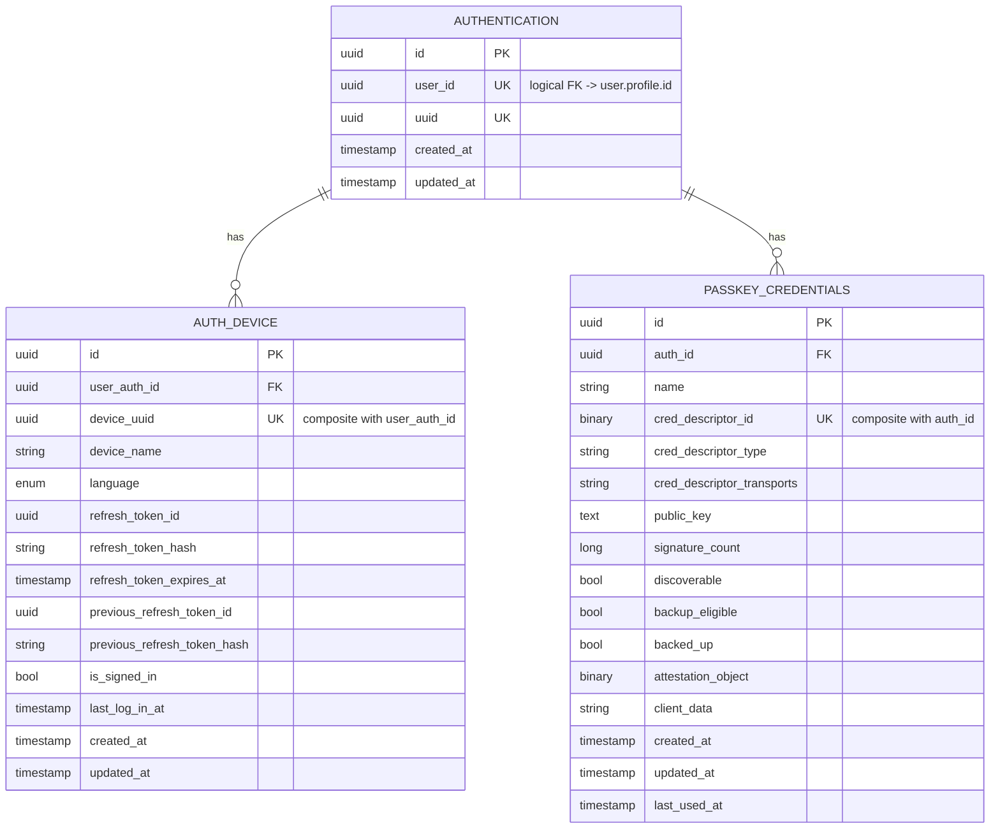
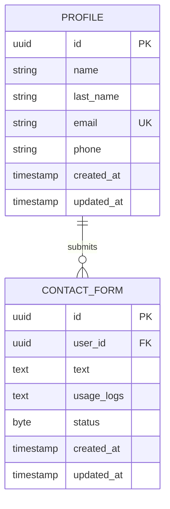
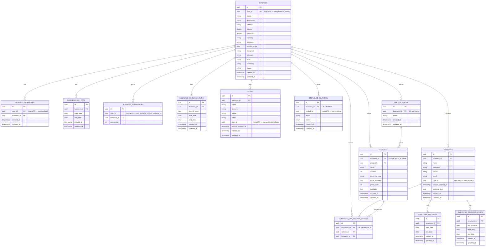
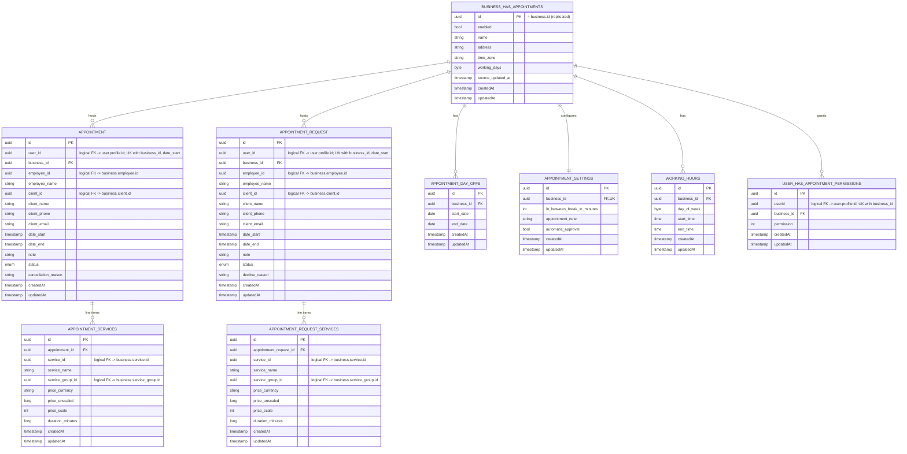
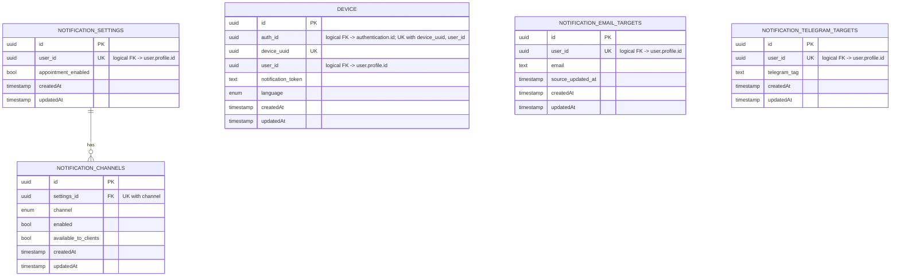
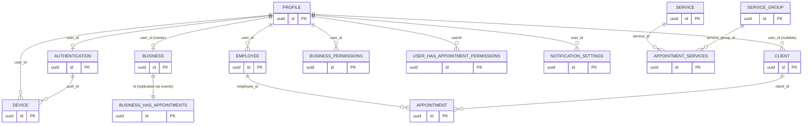

# Database ER Diagrams

bookk-server is a modular monolith split into independently deployable Ktor
microservices. Each microservice owns its own tables (there is no shared
database and no real cross-service foreign key) — cross-service links below
are **logical** references (a plain `uuid` column that happens to hold the id
of a row owned by another service) and are drawn as dashed relationships.

Generated from the Exposed table definitions under
`service/<svc>/data/src/main/kotlin/.../orm/table/`.

- [Authorization service](#authorization-service)
- [User service](#user-service)
- [Business service](#business-service)
- [Appointments service](#appointments-service)
- [Notifications service](#notifications-service)
- [Cross-service overview](#cross-service-overview)

All tables inherit an `id UUID PK`. Tables extending the shared
`BaseUUIDTable` additionally get `createdAt` / `updatedAt` (nullable); tables
built directly on Exposed's `UuidTable` declare their own timestamp columns
where present — both are shown per table below.

---

## Authorization service

Owns login/session/device and WebAuthn passkey state, keyed off `authentication.user_id`
(a logical reference to `user.profile.id`).

---

## User service

Smallest schema — the canonical user profile and inbound contact-form submissions.

---

## Business service

Largest schema — a business, its staff, services and clients.

---

## Appointments service

Keeps its own denormalized copy of business identity (`business_has_appointments`,
populated from the business service via events) so booking logic never has to
cross a service boundary at read time.

---

## Notifications service

Fan-in tables keyed by `user_id`, feeding channel dispatch for a given user across devices/targets.

`notification_email_targets` and `notification_telegram_targets` are not
foreign-keyed to `notification_settings` in the schema — they are joined to a
user's settings at query time via the shared `user_id`.

---

## Cross-service overview

No database enforces these edges — each service has its own schema/connection
pool, and the referencing column is a plain `uuid`. Consistency is maintained
via domain events (see `service/<svc>/client`) rather than DB constraints.

