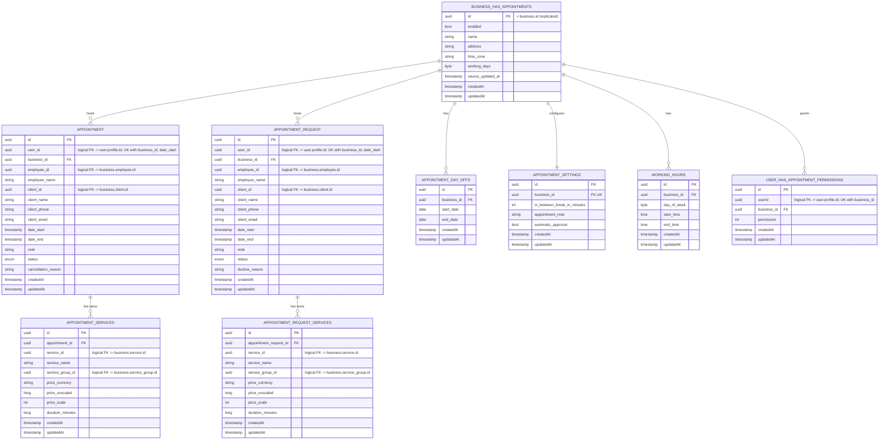

[← Database ER diagrams](README.md)

# Appointments service

Keeps its own denormalized copy of business identity (`business_has_appointments`,
populated from the business service via events) so booking logic never has to
cross a service boundary at read time.

