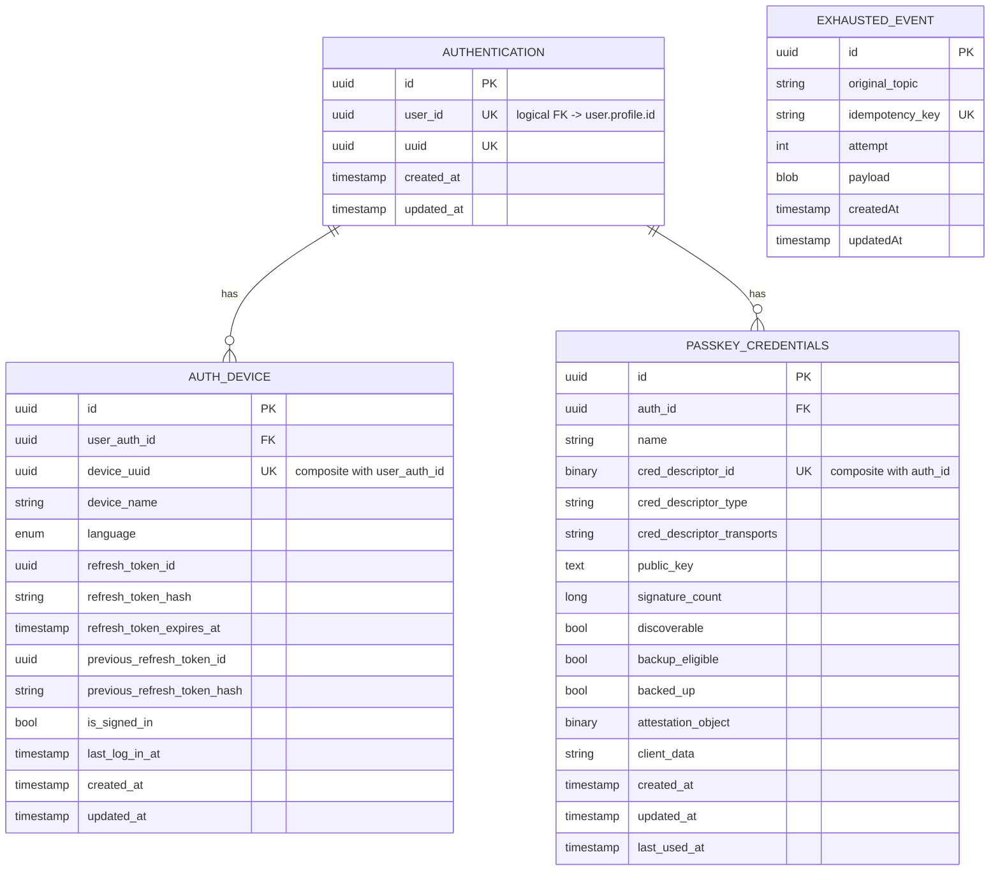

[← Database ER diagrams](README.md)

# Authorization service

Owns login/session/device and WebAuthn passkey state, keyed off `authentication.user_id`
(a logical reference to `user.profile.id`).

`EXHAUSTED_EVENT` is not part of the authorization domain model — it's the shared DLT landing table (`core/data/eventstreaming/data`, one instance per service schema) that `KafkaEventConsumer`/`EmbeddedEventConsumer` write to when an event exhausts its retry budget, so a failed event survives a process restart or crash instead of being lost. See `AGENTS.md`'s event-streaming retry design notes.
