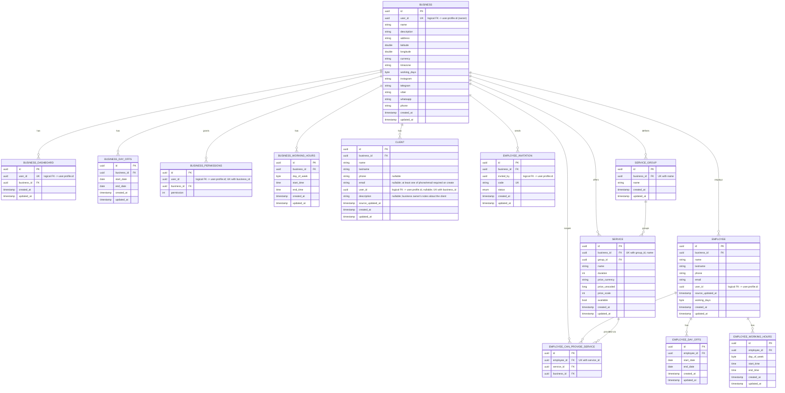

[← Database ER diagrams](README.md)

# Business service

Largest schema — a business, its staff, services and clients.

```mermaid
erDiagram
    BUSINESS ||--o{ BUSINESS_DASHBOARD : "has"
    BUSINESS ||--o{ BUSINESS_DAY_OFFS : "has"
    BUSINESS ||--o{ BUSINESS_PERMISSIONS : "grants"
    BUSINESS ||--o{ BUSINESS_WORKING_HOURS : "has"
    BUSINESS ||--o{ CLIENT : "has"
    BUSINESS ||--o{ EMPLOYEE : "employs"
    BUSINESS ||--o{ EMPLOYEE_INVITATION : "sends"
    BUSINESS ||--o{ SERVICE_GROUP : "defines"
    BUSINESS ||--o{ SERVICE : "offers"
    BUSINESS ||--o{ EMPLOYEE_CAN_PROVIDE_SERVICE : "scopes"
    EMPLOYEE ||--o{ EMPLOYEE_CAN_PROVIDE_SERVICE : "can provide"
    SERVICE ||--o{ EMPLOYEE_CAN_PROVIDE_SERVICE : "provided via"
    EMPLOYEE ||--o{ EMPLOYEE_DAY_OFFS : "has"
    EMPLOYEE ||--o{ EMPLOYEE_WORKING_HOURS : "has"
    SERVICE_GROUP ||--o{ SERVICE : "groups"

    BUSINESS {
        uuid id PK
        uuid user_id UK "logical FK -> user.profile.id (owner)"
        string name
        string description
        string address
        double latitude
        double longitude
        string currency
        string timezone
        byte working_days
        string instagram
        string telegram
        string viber
        string whatsapp
        string phone
        timestamp created_at
        timestamp updated_at
    }

    BUSINESS_DASHBOARD {
        uuid id PK
        uuid user_id UK "logical FK -> user.profile.id"
        uuid business_id FK
        timestamp created_at
        timestamp updated_at
    }

    BUSINESS_DAY_OFFS {
        uuid id PK
        uuid business_id FK
        date start_date
        date end_date
        timestamp created_at
        timestamp updated_at
    }

    BUSINESS_PERMISSIONS {
        uuid id PK
        uuid user_id "logical FK -> user.profile.id; UK with business_id"
        uuid business_id FK
        int permission
    }

    BUSINESS_WORKING_HOURS {
        uuid id PK
        uuid business_id FK
        byte day_of_week
        time start_time
        time end_time
        timestamp created_at
        timestamp updated_at
    }

    CLIENT {
        uuid id PK
        uuid business_id FK
        string name
        string lastname
        string phone "nullable"
        string email "nullable; at least one of phone/email required on create"
        uuid user_id "logical FK -> user.profile.id, nullable; UK with business_id"
        string description "nullable; business owner's notes about the client"
        timestamp source_updated_at
        timestamp created_at
        timestamp updated_at
    }

    EMPLOYEE {
        uuid id PK
        uuid business_id FK
        string name
        string lastname
        string phone
        string email
        uuid user_id "logical FK -> user.profile.id"
        timestamp source_updated_at
        byte working_days
        timestamp created_at
        timestamp updated_at
    }

    EMPLOYEE_CAN_PROVIDE_SERVICE {
        uuid id PK
        uuid employee_id FK "UK with service_id"
        uuid service_id FK
        uuid business_id FK
    }

    EMPLOYEE_DAY_OFFS {
        uuid id PK
        uuid employee_id FK
        date start_date
        date end_date
        timestamp created_at
        timestamp updated_at
    }

    EMPLOYEE_INVITATION {
        uuid id PK
        uuid business_id FK
        uuid invited_by "logical FK -> user.profile.id"
        string code UK
        enum status
        timestamp created_at
        timestamp updated_at
    }

    EMPLOYEE_WORKING_HOURS {
        uuid id PK
        uuid employee_id FK
        byte day_of_week
        time start_time
        time end_time
        timestamp created_at
        timestamp updated_at
    }

    SERVICE_GROUP {
        uuid id PK
        uuid business_id FK "UK with name"
        string name
        timestamp created_at
        timestamp updated_at
    }

    SERVICE {
        uuid id PK
        uuid business_id FK "UK with group_id, name"
        uuid group_id FK
        string name
        int duration
        string price_currency
        long price_unscaled
        int price_scale
        bool available
        timestamp created_at
        timestamp updated_at
    }
```
