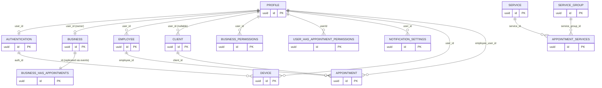

[← Database ER diagrams](README.md)

# Cross-service overview

No database enforces these edges — each service has its own schema/connection
pool, and the referencing column is a plain `uuid`. Consistency is maintained
via domain events (see `service/<svc>/client`) rather than DB constraints.

