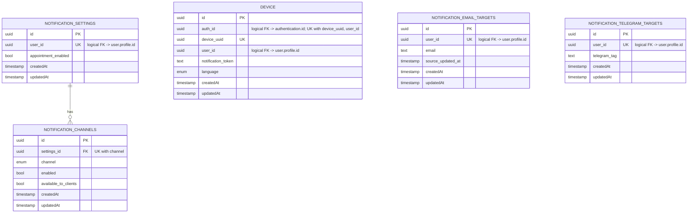

[← Database ER diagrams](README.md)

# Notifications service

Fan-in tables keyed by `user_id`, feeding channel dispatch for a given user across devices/targets.

`notification_email_targets` and `notification_telegram_targets` are not
foreign-keyed to `notification_settings` in the schema — they are joined to a
user's settings at query time via the shared `user_id`.
