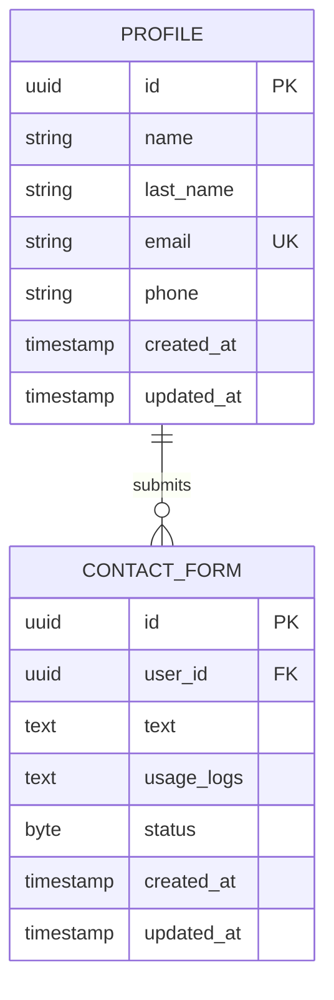

[← Database ER diagrams](README.md)

# User service

Smallest schema — the canonical user profile and inbound contact-form submissions.

```mermaid
erDiagram
    PROFILE ||--o{ CONTACT_FORM : "submits"

    PROFILE {
        uuid id PK
        string name
        string last_name
        string email UK
        string phone
        timestamp created_at
        timestamp updated_at
    }

    CONTACT_FORM {
        uuid id PK
        uuid user_id FK
        text text
        text usage_logs
        byte status
        timestamp created_at
        timestamp updated_at
    }
```
