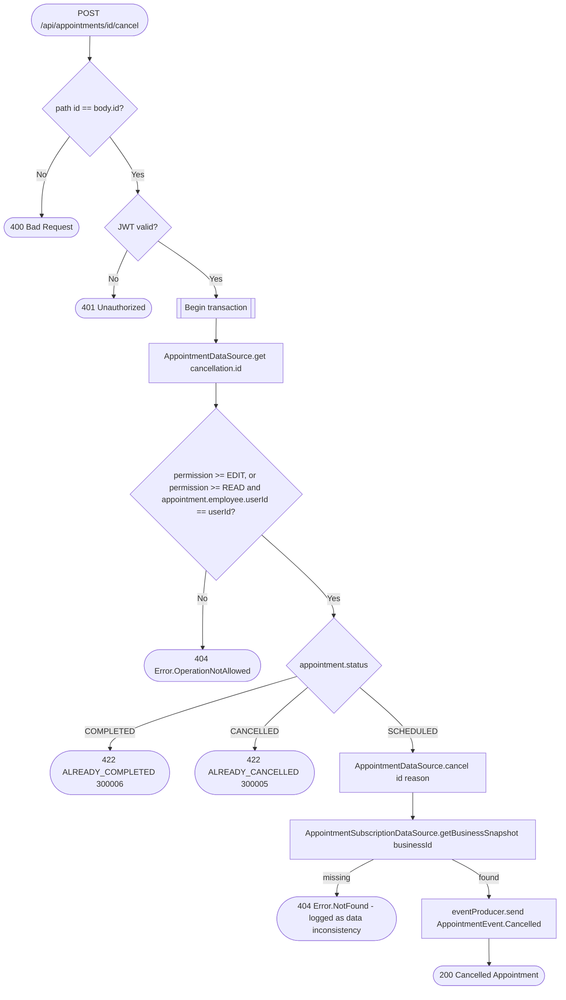

# Cancel appointment

`POST /api/appointments/{id}/cancel` → `CancelAppointment`

Only a scheduled appointment can be cancelled; the status switch and the
write both read the same fetched row within the transaction. The
appointment is fetched before the permission check so a `READ`-level
employee can be let through when it's their own — see [Managing your own
resource on a `READ`
grant](../../object-permissions.md#managing-your-own-resource-on-a-read-grant).

**Consumed by:** `AppointmentEvent.Cancelled` → [notifications: notify the
client](../notifications/on-appointment-cancelled.md).
