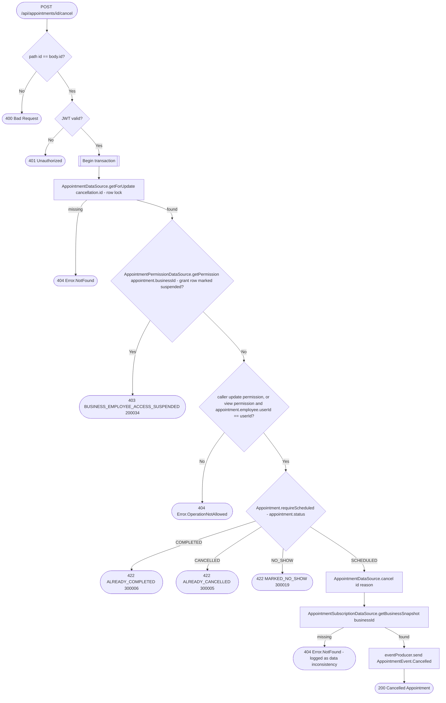

# Cancel appointment

`POST /api/appointments/{id}/cancel` → `CancelAppointment`

Only a scheduled appointment can be cancelled. The operation reads the
appointment with `getForUpdate` (`SELECT … FOR UPDATE`) as its first read,
so the `Appointment.requireScheduled()` check and the write see the same
locked row. The business is taken from the stored appointment; the body
(`AppointmentCancellation`) carries only the appointment id and the reason. The appointment is fetched before the permission check so a `view`-only
employee can be let through when it's their own — see [Managing your own
resource on a `view`
grant](../../object-permissions.md#managing-your-own-resource-on-a-view-grant).

```mermaid
flowchart TD
    Start([POST /api/appointments/id/cancel]) --> PathCheck{path id == body.id?}
    PathCheck -- No --> R400([400 Bad Request])
    PathCheck -- Yes --> Auth{JWT valid?}
    Auth -- No --> R401([401 Unauthorized])
    Auth -- Yes --> Tx[[Begin transaction]]
    Tx --> Get[AppointmentDataSource.getForUpdate cancellation.id - row lock]
    Get -- missing --> R404n([404 Error.NotFound])
    Get -- found --> Suspended{AppointmentPermissionDataSource.getPermission appointment.businessId - grant row marked suspended?}
    Suspended -- Yes --> R403s([403 BUSINESS_EMPLOYEE_ACCESS_SUSPENDED 200034])
    Suspended -- No --> Perm{caller update permission, or view permission and appointment.employee.userId == userId?}
    Perm -- No --> R404a([404 Error.OperationNotAllowed])
    Perm -- Yes --> Status{Appointment.requireScheduled - appointment.status}
    Status -- COMPLETED --> R422a([422 ALREADY_COMPLETED 300006])
    Status -- CANCELLED --> R422b([422 ALREADY_CANCELLED 300005])
    Status -- NO_SHOW --> R422c([422 MARKED_NO_SHOW 300019])
    Status -- SCHEDULED --> Cancel[AppointmentDataSource.cancel id reason]
    Cancel --> Snapshot[AppointmentSubscriptionDataSource.getBusinessSnapshot businessId]
    Snapshot -- missing --> R404b([404 Error.NotFound - logged as data inconsistency])
    Snapshot -- found --> Event[eventProducer.send AppointmentEvent.Cancelled]
    Event --> R200([200 Cancelled Appointment])
```

**Consumed by:** `AppointmentEvent.Cancelled` → [notifications: notify the
client](../notifications/on-appointment-cancelled.md).
