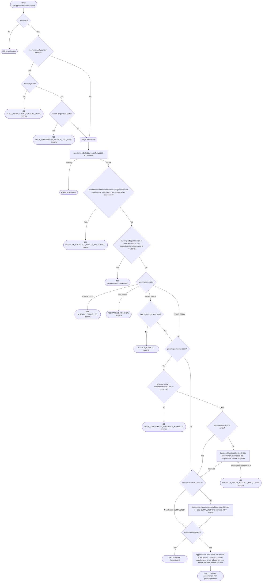

# Complete appointment

`POST /api/appointments/{id}/complete` → `CompleteAppointment`

Records that the appointment took place, with `completedBy = USER`. This is
how a business that switched `automaticCompletion` off in its appointment
settings closes its appointments — the `MarkAppointmentsCompleted` job skips
those businesses (see [Scheduled (recurring) jobs](../scheduled-jobs.md)).
It works for businesses with automatic completion on as well, e.g. to close an
appointment before the job reaches it.

Only a `SCHEDULED` appointment that has already started can be completed.
Completing an appointment that is already `COMPLETED` succeeds unchanged —
its existing `completedBy` (possibly `SYSTEM`) is kept. The operation reads
the appointment with `getForUpdate` (`SELECT … FOR UPDATE`) as its first
read, checks status and start time itself, and only then calls the
unconditional `markCompletedByUser` write, so a concurrent cancel, no-show or
job run cannot slip in between. Resolving additional services from the
business service happens while that single-row lock is held.

The business is taken from the stored appointment, never from the request.
The appointment is fetched before the permission check so a `view`-only
employee can be let through when it's their own — see [Managing your own
resource on a `view`
grant](../../object-permissions.md#managing-your-own-resource-on-a-view-grant).

## Price adjustment at checkout

The body is optional (`CompleteAppointmentRequest`, an empty body is the same
as no adjustment). Its `priceAdjustment` (`PriceAdjustmentDraft`) carries:

- `price` — **mandatory**, the final amount charged. It replaces the sum of the
  booked and additional services rather than adding to it. It must be ≥ 0 and
  in the appointment's currency.
- `additionalServiceIds` — optional catalog service ids added at checkout,
  repeated for multiples. Only the ids come from the client: name, price,
  duration and group are resolved from the business service through
  `BusinessClient.getServicesByIds` (`POST
  /api/internal/business/{id}/services`) and stored as snapshots.
- `reason` — optional, at most 2048 characters; blank is stored as absent.

The adjustment is stored only when the appointment ends up `COMPLETED`. It is
also stored on an appointment that was already `COMPLETED`, including one the
job completed, replacing any previous adjustment. Without that, an adjustment
sent just after the automatic job closed the appointment would be dropped
silently. The write runs under the row lock taken by `getForUpdate`.

No event is published.
