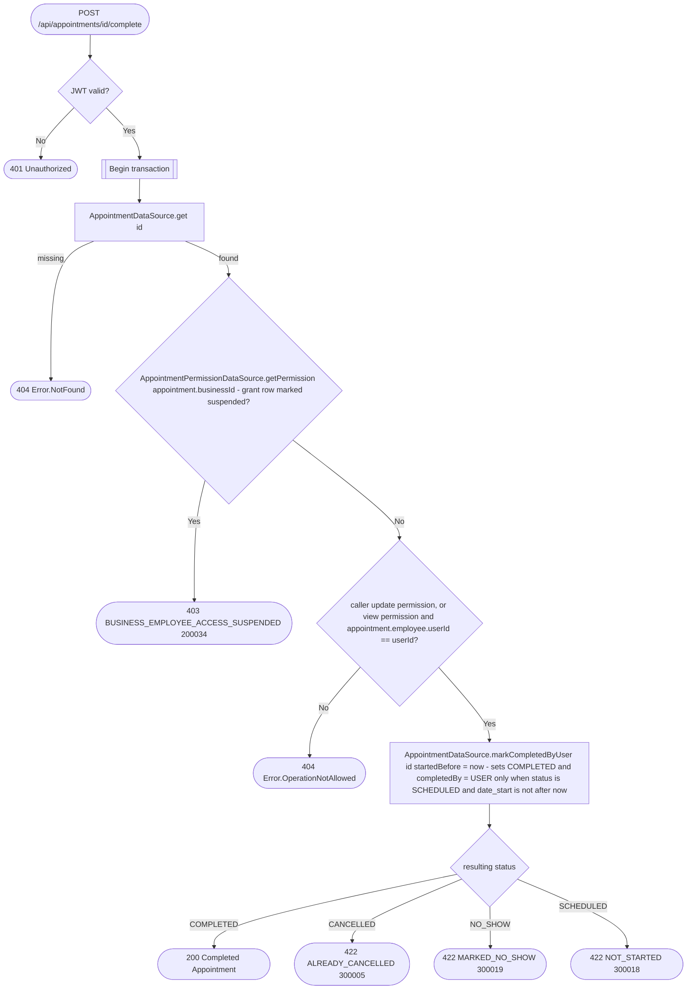

# Complete appointment

`POST /api/appointments/{id}/complete` → `CompleteAppointment`

Records that the appointment took place, with `completedBy = USER`. This is
how a business that switched `automaticCompletion` off in its appointment
settings closes its appointments — the `MarkAppointmentsCompleted` job skips
those businesses (see [Scheduled (recurring) jobs](../scheduled-jobs.md)).
It works for businesses with automatic completion on as well, e.g. to close an
appointment before the job reaches it.

Only a `SCHEDULED` appointment that has already started can be completed.
Completing an appointment that is already `COMPLETED` succeeds unchanged —
its existing `completedBy` (possibly `SYSTEM`) is kept. The eligibility check
and the status write share the `SELECT … FOR UPDATE` row lock of
`findByIdAndUpdate`, so a concurrent cancel, no-show or job run cannot slip
in between.

The business is taken from the stored appointment, never from the request.
The appointment is fetched before the permission check so a `view`-only
employee can be let through when it's their own — see [Managing your own
resource on a `view`
grant](../../object-permissions.md#managing-your-own-resource-on-a-view-grant).

No event is published.
