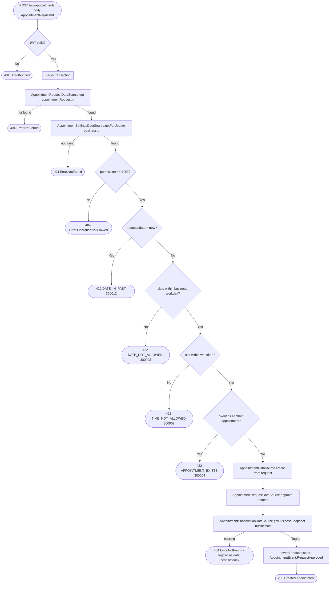

# Create appointment from a pending request

`POST /api/appointments` → `CreateAppointment` (via `appointmentRequestId`)

Converts an already-existing `AppointmentRequest` into a confirmed
`Appointment`. Shares its verification logic (workday/worktime/overlap
checks) with [Create instant appointment](create-appointment-instant.md) and
with the auto-approval branch of [Create appointment
request](create-appointment-request.md).

**Consumed by:** `AppointmentEvent.RequestApproved` → [notifications: notify
the client](../notifications/on-appointment-request-approved.md).
