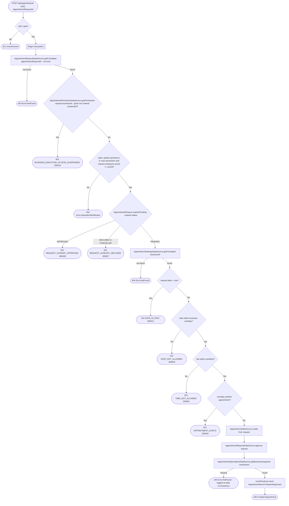

# Create appointment from a pending request

`POST /api/appointments` → `CreateAppointment` (via `appointmentRequestId`)

Converts an already-existing `AppointmentRequest` into a confirmed
`Appointment`. Shares its verification logic (workday/worktime/overlap
checks) with [Create instant appointment](create-appointment-instant.md) and
with the auto-approval branch of [Create appointment
request](create-appointment-request.md). A `view`-only employee can
convert their own request; see [Managing your own resource on a `view`
grant](../../object-permissions.md#managing-your-own-resource-on-a-view-grant).

The request is read with `AppointmentRequestDataSource.getForUpdate`
(`SELECT … FOR UPDATE`) as the first read and must still be `PENDING`
(`AppointmentRequest.requirePending()`). That row lock is what serializes an
approval against a concurrent [decline](decline-appointment-request.md), a
second approval, or the `cancelOutdated` job: the loser waits for the winner
to commit and then sees the new status instead of overwriting it. The request
lock is taken before the settings lock.

```mermaid
flowchart TD
    Start([POST /api/appointments body AppointmentRequestId]) --> Auth{JWT valid?}
    Auth -- No --> R401([401 Unauthorized])
    Auth -- Yes --> Tx[[Begin transaction]]
    Tx --> GetRequest[AppointmentRequestDataSource.getForUpdate appointmentRequestId - row lock]
    GetRequest -- not found --> R404a([404 Error.NotFound])
    GetRequest -- found --> Suspended{AppointmentPermissionDataSource.getPermission request.businessId - grant row marked suspended?}
    Suspended -- Yes --> R403s([403 BUSINESS_EMPLOYEE_ACCESS_SUSPENDED 200034])
    Suspended -- No --> Perm{caller update permission, or view permission and request.employee.userId == userId?}
    Perm -- No --> R404b([404 Error.OperationNotAllowed])
    Perm -- Yes --> Pending{AppointmentRequest.requirePending - request.status}
    Pending -- APPROVED --> R422e([422 REQUEST_ALREADY_APPROVED 300008])
    Pending -- DECLINED or CANCELLED --> R422f([422 REQUEST_ALREADY_DECLINED 300007])
    Pending -- PENDING --> Settings[AppointmentSettingsDataSource.getForUpdate businessId]
    Settings -- not found --> R404c([404 Error.NotFound])
    Settings -- found --> PastCheck{request.date < now?}
    PastCheck -- Yes --> R422a([422 DATE_IN_PAST 300012])
    PastCheck -- No --> WorkdayCheck{date within business workday?}
    WorkdayCheck -- No --> R422b([422 DATE_NOT_ALLOWED 300003])
    WorkdayCheck -- Yes --> WorktimeCheck{slot within worktime?}
    WorktimeCheck -- No --> R422c([422 TIME_NOT_ALLOWED 300002])
    WorktimeCheck -- Yes --> Overlap{overlaps another appointment?}
    Overlap -- Yes --> R422d([422 APPOINTMENT_EXISTS 300004])
    Overlap -- No --> Create[AppointmentDataSource.create from request]
    Create --> Approve[AppointmentRequestDataSource.approve request]
    Approve --> Snapshot[AppointmentSubscriptionDataSource.getBusinessSnapshot businessId]
    Snapshot -- missing --> R404d([404 Error.NotFound - logged as data inconsistency])
    Snapshot -- found --> Event[eventProducer.send AppointmentEvent.RequestApproved]
    Event --> R200([200 Created Appointment])
```

**Consumed by:** `AppointmentEvent.RequestApproved` → [notifications: notify
the client](../notifications/on-appointment-request-approved.md).
