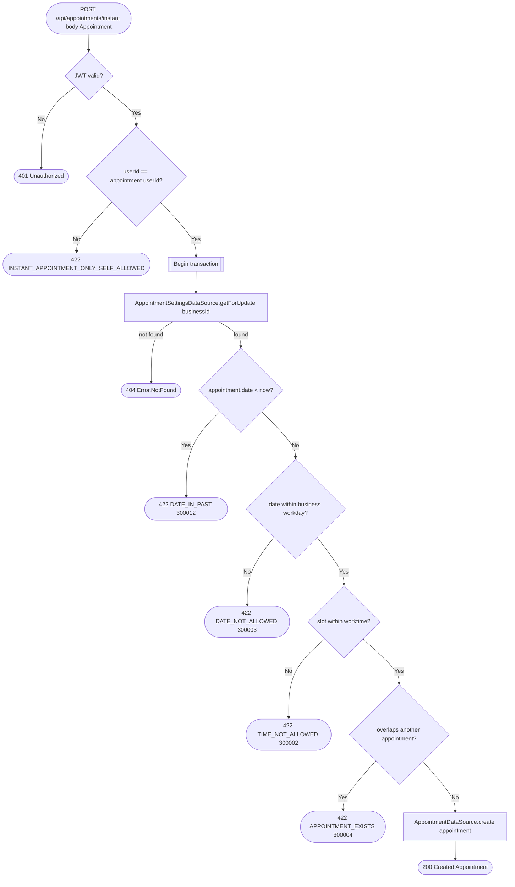

# Create instant appointment

`POST /api/appointments/instant` → `CreateAppointment` (`isInstant = true`)

Books a slot directly without going through the request/approval flow.
Restricted to self-booking: the caller must be the appointment's own
client, checked via `userId == appointment.userId` before anything else runs.
No request-approval event fires here since there was never a pending
request. That self-check is this operation's only authorization gate —
there is no business-permission check, since the caller is the client
booking with the business, not a staff member.

