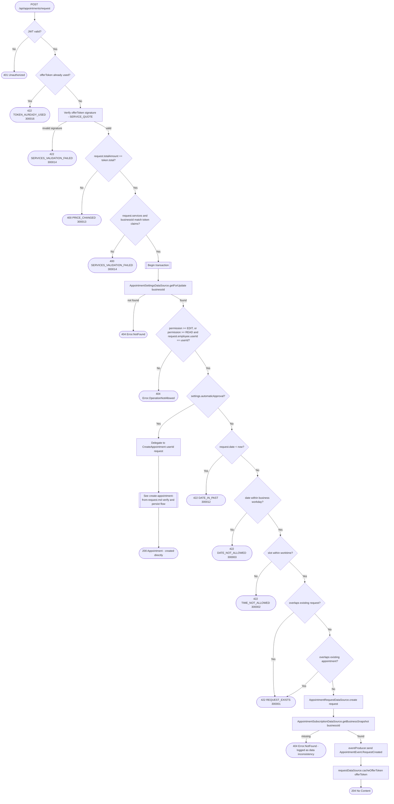

# Create appointment request

`POST /api/appointments/request` → `CreateAppointmentRequest`

A client submits an `AppointmentOffer` produced earlier by the business
service's `POST /api/service/quote` (`IssueQuote`, read-only — not
diagrammed here): a signed `offerToken` plus the
requested slot. The token is verified and its claims (services, total,
business id) are cross-checked against the request body before anything is
persisted, so a stale or tampered quote is rejected up front. If the
business has `automaticApproval` on, the request is approved immediately by
delegating into [Create appointment from a pending
request](create-appointment-from-request.md)'s shared verify/persist logic
instead of being stored as pending. A `READ`-level employee can create a
request assigned to themselves; see [Managing your own resource on a
`READ`
grant](../../object-permissions.md#managing-your-own-resource-on-a-read-grant).

**Consumed by:** `AppointmentEvent.RequestCreated` → [notifications: notify the
employee](../notifications/on-appointment-request-created.md). The
`automaticApproval` branch delegates into [Create appointment from a
pending request](create-appointment-from-request.md)'s shared logic and
sends `AppointmentEvent.RequestApproved` instead — see [notifications:
notify the client of
approval](../notifications/on-appointment-request-approved.md).
