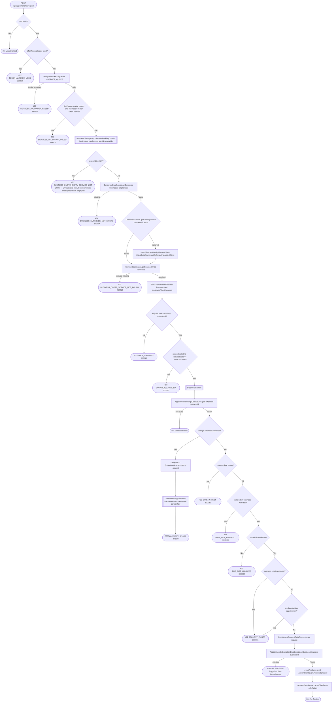

# Create appointment request

`POST /api/appointments/request` → `CreateAppointmentRequest`

A client submits an `AppointmentRequestDraft` carrying the signed
`offerToken` produced earlier by the business service's
`POST /api/service/quote` (`IssueServiceQuote`, read-only — not diagrammed
here) alongside only the requested slot and the ids of the employee and
services — no name, contact or pricing data travels from the client, and no
client id either: the caller never gets to assert whose client record a
booking attaches to, it is always the authenticated `userId`. A service id
may repeat in `draft.serviceIds` to request more than one count of it (e.g.
5 counts of service X); `IssueServiceQuote` signs the *count per distinct
service id* into `QuoteClaims.CLAIM_SERVICES`
(`QuoteClaims.encodeServiceCounts` — `"<serviceId>:<count>"` entries, not a
flat repeated list) rather than a plain id set. The token's claims (service
counts, business id) are cross-checked against the draft's own per-id
counts before anything else happens, so a stale or tampered quote — or a
request that changes how many of a service were asked for — is rejected up
front. The employee, client and services are then resolved from the
business service in a single call to `GetAppointmentBookingContext`
(`BusinessClient.getAppointmentBookingContext`, given `businessId`,
`employeeId`, the caller's `userId` and `serviceIds`) — this is the
operation's actual authorization gate for *identity*: an employee that no
longer exists in the business, or a service that has since been removed,
fails here even if the signature check passed. The client side of that
resolution is a get-or-create keyed on `(businessId, userId)`
(`ClientDataSource.getClientByUserId`, falling back to
`ClientDataSource.getOrCreateIntegratedClient` seeded from the caller's
profile via `UserClient.getUserById` on the very first booking with this
business) inside the same call — so a first-time client is provisioned
without appointments ever needing to know or store a client id itself, and
without a second round trip to business. Only once that context is
resolved is the full `AppointmentRequest` (with real `EmployeeSnapshot`,
`ClientSnapshot`, `ServiceSnapshot`s) built and its total price *and* total
duration compared against the token's frozen values — the quote signs both
(`QuoteClaims.CLAIM_TOTAL`, `CLAIM_DURATION`), so a service whose duration
changes after the quote was issued (even if its price didn't) is caught the
same way a price change is, instead of silently booking a
longer-or-shorter slot than the client agreed to. There is no business-permission check on
top of this, since the caller is the client booking with the business, not
a staff member. If the business has `automaticApproval` on, the request is
approved immediately by delegating into [Create appointment from a pending
request](create-appointment-from-request.md)'s shared verify/persist logic
instead of being stored as pending.

**Consumed by:** `AppointmentEvent.RequestCreated` → [notifications: notify the
employee](../notifications/on-appointment-request-created.md). The
`automaticApproval` branch delegates into [Create appointment from a
pending request](create-appointment-from-request.md)'s shared logic and
sends `AppointmentEvent.RequestApproved` instead — see [notifications:
notify the client of
approval](../notifications/on-appointment-request-approved.md).
