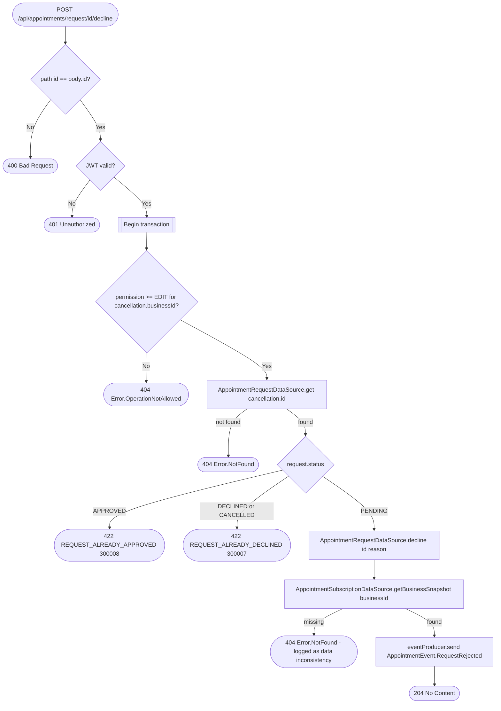

# Decline appointment request

`POST /api/appointments/request/{id}/decline` → `DeclineAppointmentRequest`

Only a pending request can be declined; the current status is checked
inside the same locking read (`getForUpdate`-style) that performs the write,
so a concurrent approval and decline can't both succeed.

**Consumed by:** `AppointmentEvent.RequestRejected` → [notifications: notify
the client](../notifications/on-appointment-request-rejected.md).
