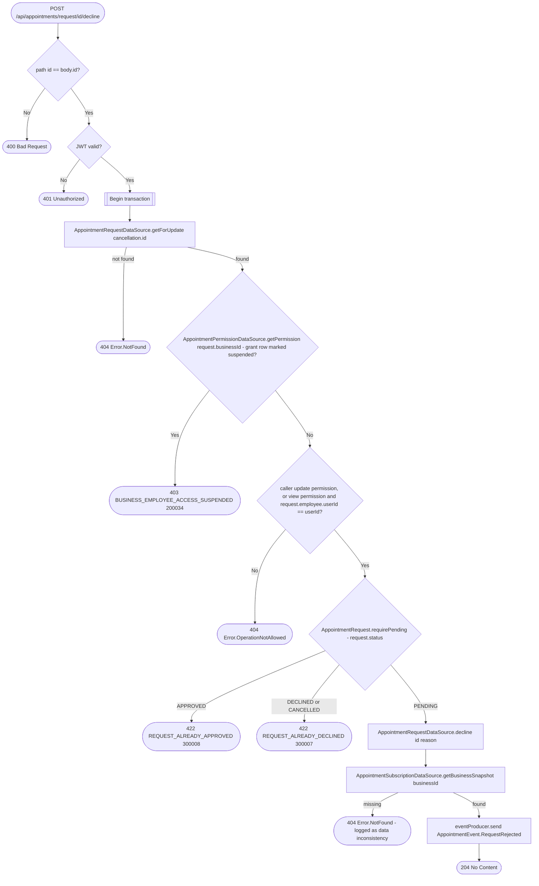

# Decline appointment request

`POST /api/appointments/request/{id}/decline` → `DeclineAppointmentRequest`

Only a pending request can be declined. The request is read with
`AppointmentRequestDataSource.getForUpdate` (`SELECT … FOR UPDATE`) as the
first read, so the status check and the `decline` write see the same locked
row. [Approving a request](create-appointment-from-request.md) takes the
same lock and runs the same `AppointmentRequest.requirePending()` check, so a
decline and a concurrent approval (or two declines) are serialized and only
one of them can succeed.
The business is taken from the stored request;
the body (`AppointmentCancellation`) carries only the request id and the
reason. The request is fetched before the permission check so a `view`-only employee can be let
through when it's their own — see [Managing your own resource on a `view`
grant](../../object-permissions.md#managing-your-own-resource-on-a-view-grant).

```mermaid
flowchart TD
    Start([POST /api/appointments/request/id/decline]) --> PathCheck{path id == body.id?}
    PathCheck -- No --> R400([400 Bad Request])
    PathCheck -- Yes --> Auth{JWT valid?}
    Auth -- No --> R401([401 Unauthorized])
    Auth -- Yes --> Tx[[Begin transaction]]
    Tx --> Get[AppointmentRequestDataSource.getForUpdate cancellation.id]
    Get -- not found --> R404b([404 Error.NotFound])
    Get -- found --> Suspended{AppointmentPermissionDataSource.getPermission request.businessId - grant row marked suspended?}
    Suspended -- Yes --> R403s([403 BUSINESS_EMPLOYEE_ACCESS_SUSPENDED 200034])
    Suspended -- No --> Perm{caller update permission, or view permission and request.employee.userId == userId?}
    Perm -- No --> R404a([404 Error.OperationNotAllowed])
    Perm -- Yes --> Status{AppointmentRequest.requirePending - request.status}
    Status -- APPROVED --> R422a([422 REQUEST_ALREADY_APPROVED 300008])
    Status -- DECLINED or CANCELLED --> R422b([422 REQUEST_ALREADY_DECLINED 300007])
    Status -- PENDING --> Decline[AppointmentRequestDataSource.decline id reason]
    Decline --> Snapshot[AppointmentSubscriptionDataSource.getBusinessSnapshot businessId]
    Snapshot -- missing --> R404c([404 Error.NotFound - logged as data inconsistency])
    Snapshot -- found --> Event[eventProducer.send AppointmentEvent.RequestRejected]
    Event --> R204([204 No Content])
```

**Consumed by:** `AppointmentEvent.RequestRejected` → [notifications: notify
the client](../notifications/on-appointment-request-rejected.md).
