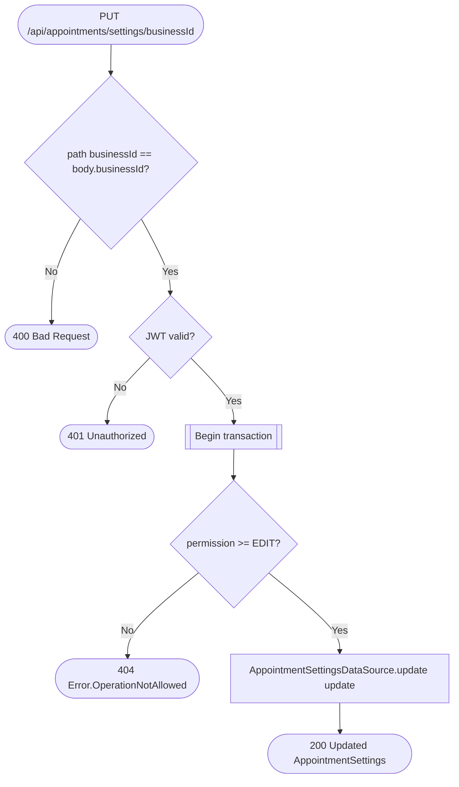

# Edit appointment settings

`PUT /api/appointments/settings/{businessId}` → `EditSettings`

Simple permission-gated update; the working schedule and day-offs live on
the business service and are not touched here (see the `Description` in the
route KDoc).

