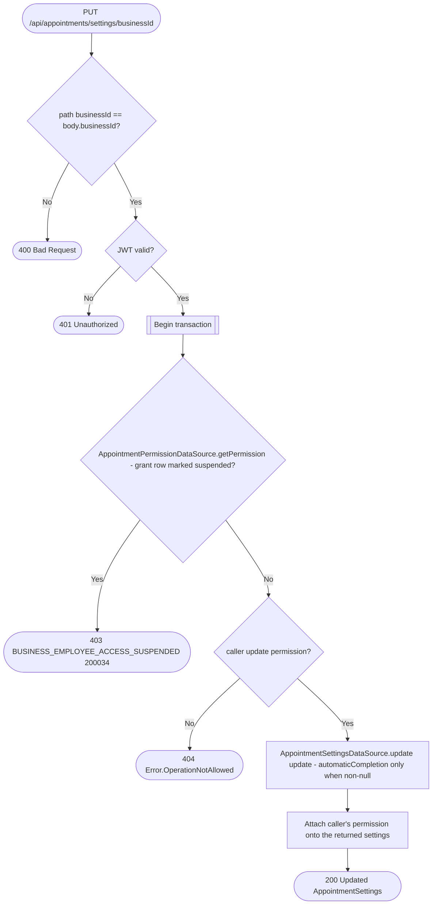

# Edit appointment settings

`PUT /api/appointments/settings/{businessId}` → `EditSettings`

Simple permission-gated update; the working schedule and day-offs live on
the business service and are not touched here (see the `Description` in the
route KDoc).

`automaticCompletion` controls whether the `MarkAppointmentsCompleted` job
completes this business's past appointments (see [Scheduled (recurring)
jobs](../scheduled-jobs.md)); when off, staff use [Complete
appointment](complete-appointment.md). It is optional on the request — a
`null` keeps the stored value, so clients that predate the field don't
switch it back on.

```mermaid
flowchart TD
    Start([PUT /api/appointments/settings/businessId]) --> PathCheck{path businessId == body.businessId?}
    PathCheck -- No --> R400([400 Bad Request])
    PathCheck -- Yes --> Auth{JWT valid?}
    Auth -- No --> R401([401 Unauthorized])
    Auth -- Yes --> Tx[[Begin transaction]]
    Tx --> Suspended{AppointmentPermissionDataSource.getPermission - grant row marked suspended?}
    Suspended -- Yes --> R403s([403 BUSINESS_EMPLOYEE_ACCESS_SUSPENDED 200034])
    Suspended -- No --> Perm{caller update permission?}
    Perm -- No --> R404([404 Error.OperationNotAllowed])
    Perm -- Yes --> Update[AppointmentSettingsDataSource.update update - automaticCompletion only when non-null]
    Update --> Attach[Attach caller's permission onto the returned settings]
    Attach --> R200([200 Updated AppointmentSettings])
```
