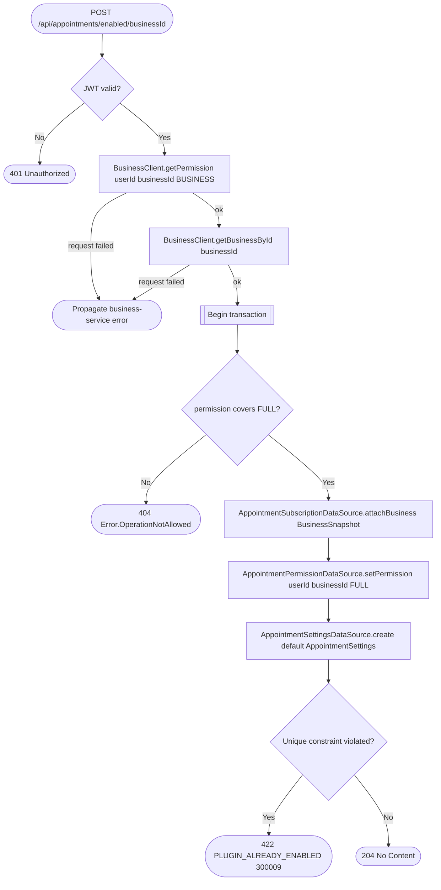

# Enable appointments for business

`POST /api/appointments/enabled/{businessId}` → `EnableAppointmentsForBusiness`

Turns the appointments plugin on for a business: pulls a snapshot of the
business (name, address, time zone, schedule) from the business service,
subscribes it locally, seeds the caller with full control
(`ResourcePermission.FULL`) in the appointments service's own permission
table, and creates default settings. All three writes share one
transaction; a repeat call collides on the subscription's unique
constraint and surfaces as `PLUGIN_ALREADY_ENABLED`.

