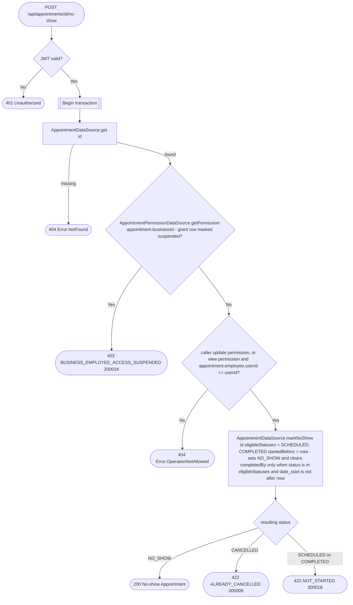

# Mark appointment as no-show

`POST /api/appointments/{id}/no-show` → `MarkAppointmentNoShow`

Records that the client missed the appointment. Only an appointment that has
already started can be marked, and it may be either still `SCHEDULED` or
already `COMPLETED` — the `MarkAppointmentsCompleted` job flips every past
appointment of a business with `automaticCompletion` on to `COMPLETED`, and
staff can [complete](complete-appointment.md) one by hand, so a no-show is
often recorded after that. Marking a `COMPLETED` appointment as no-show clears
its `completedBy`.
Marking an appointment that is already `NO_SHOW` succeeds unchanged. The
eligibility check and the status write share the `SELECT … FOR UPDATE` row
lock of `findByIdAndUpdate`, so a concurrent cancel cannot slip in between.

The business is taken from the stored appointment, never from the request.
The appointment is fetched before the permission check so a `view`-only
employee can be let through when it's their own — see [Managing your own
resource on a `view`
grant](../../object-permissions.md#managing-your-own-resource-on-a-view-grant).

No event is published.
