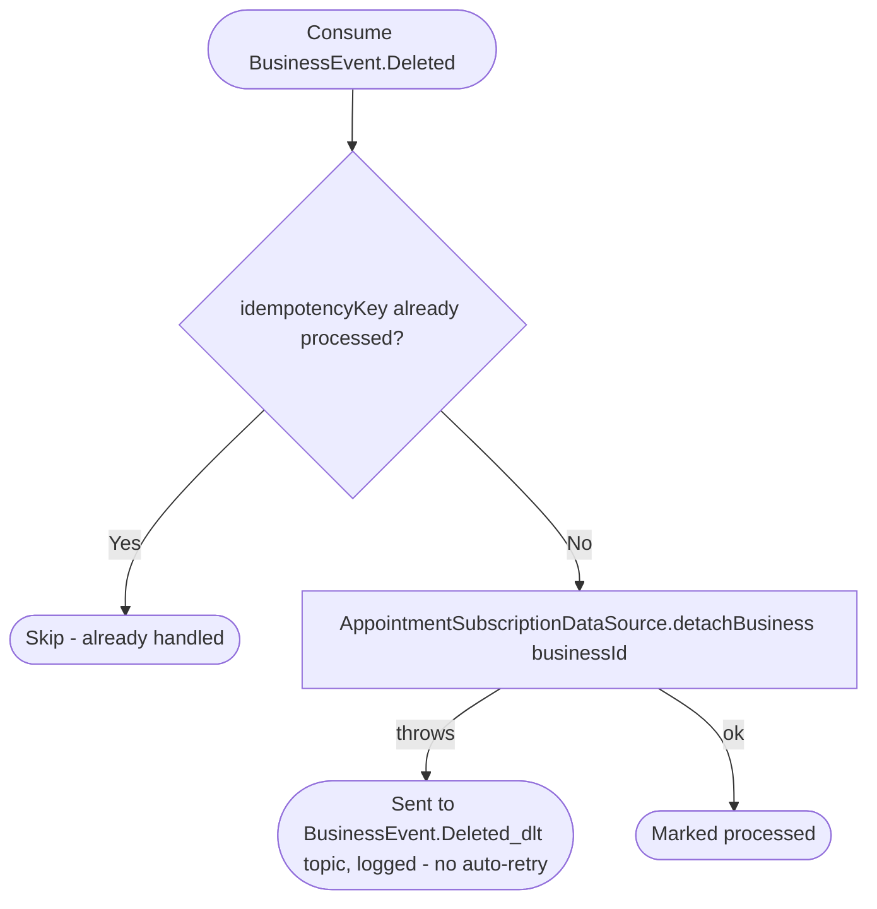

# React to business deletion

Kafka topic `BusinessEvent.Deleted` → `AppointmentEventHandler` → `DeleteModule`

Produced by the business service's reaction to account deletion — see
[React to user deletion (business)](../business/on-user-deleted.md), which
emits one `BusinessEvent.Deleted` per business owned by the deleted user.
Detaches the appointments module's own copy of the business (its
subscription/settings/permissions rows are left in place here; deleting
them is [React to user deletion
(appointments)](on-user-deleted.md)'s job when the owning user is the one
removed — a business without an owner is simply no longer bookable).

