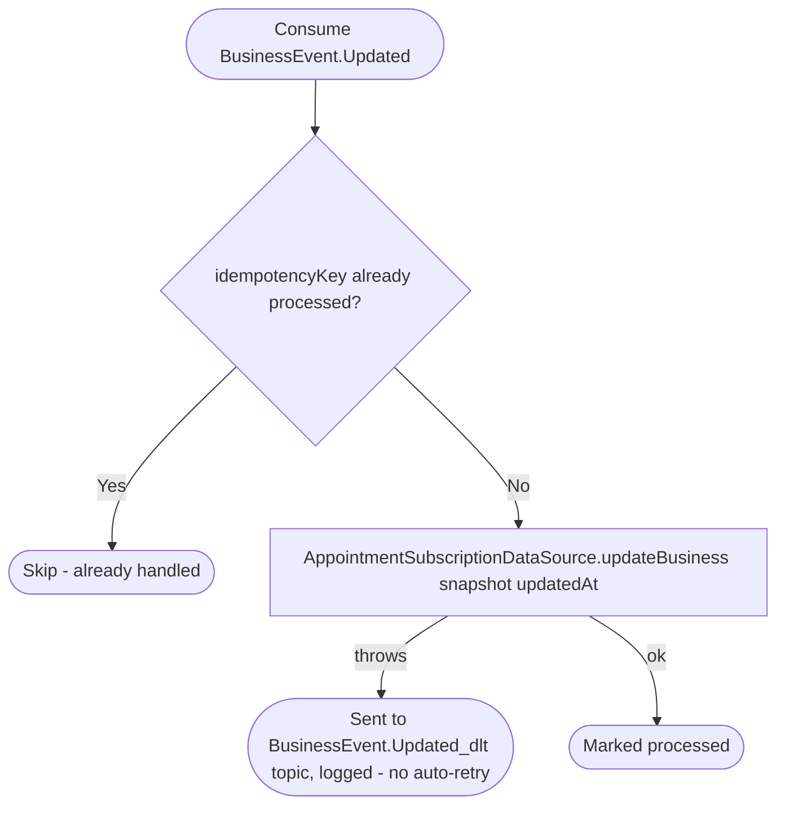

# React to business update

Kafka topic `BusinessEvent.Updated` → `AppointmentEventHandler` → `UpdateBusinessInformation`

Produced by [Update business](../business/update-business.md). Keeps the
appointments module's cached `BusinessSnapshot` (name, address, time zone,
schedule) in sync so date/time validation and cancellation notifications
use current business data without an inline call to the business service.

