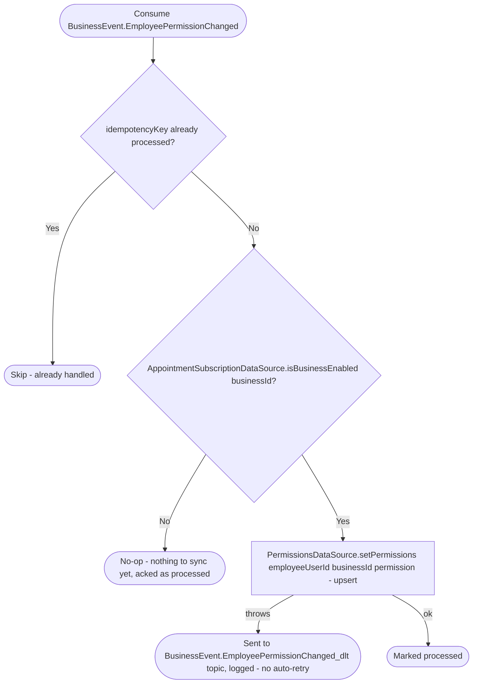

# React to an employee permission change

Kafka topic `BusinessEvent.EmployeePermissionChanged` → `AppointmentEventHandler` → `SyncEmployeePermission`

Produced by [Approve employee invitation](../business/approve-employee-invitation.md)
(grants `READ`) and [Promote employee](../business/promote-employee.md)
(grants `READ` or `EDIT`, per the requested role). Keeps the appointments
service's own copy of the grant (`UserHasAppointmentPermissions`) in sync
with the business service's source of truth, so an employee's appointments
permission level matches their business-service role without an inline
cross-service call on every appointments request. A `READ` grant lets the
employee manage only their own appointments/requests; see [Managing your
own resource on a `READ` grant](../../object-permissions.md#managing-your-own-resource-on-a-read-grant).

An employee granted or promoted before their business enables appointments
gets no row here until their permission changes again after that point —
there is no backfill on enable.
