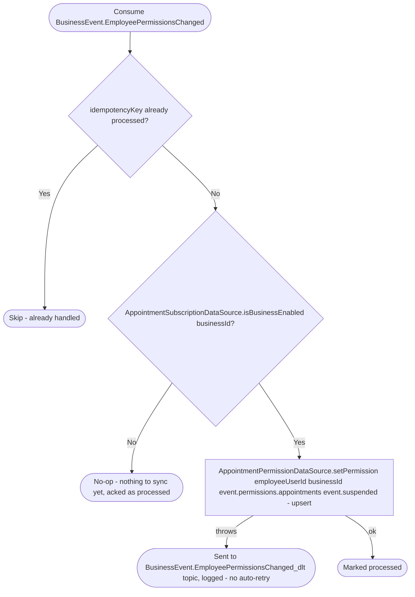

# React to an employee permissions change

Kafka topic `BusinessEvent.EmployeePermissionsChanged` → `AppointmentEventHandler` → `SyncEmployeePermission`

Produced by [Join business](../business/join-business.md) (grants
view-only on every resource) and [Set employee
permissions](../business/set-employee-permissions.md) (grants whatever
`ResourcePermission`s were requested, for one or more resources, in one
event), and [Set employee suspension](../business/set-employee-suspension.md)
(the stored grants with `suspended` set or cleared). Every producer
publishes the employee's stored grants, so the copy here always mirrors
them. The event also carries `suspended`, stored on the grant row: while it is set, `AppointmentPermissionDataSource.getPermission`
throws `library.permissions.EmployeeAccessSuspended` (403,
`BUSINESS_EMPLOYEE_ACCESS_SUSPENDED` 200034) instead of returning the grant, so
every appointments route tells a suspended employee apart from one without
access. Events produced before the flag existed decode as `suspended = false`
(the field is pinned to `@ProtoNumber(6)` and `topic` to 5). Keeps the
appointments service's own copy of the grant
(`appointment_permission_grants`) in sync with the business service's
source of truth, reading just the `appointments` field off the published
`BusinessPermissions` — every other resource in the payload is ignored, so
an employee's appointments access matches their business-service grant
without an inline cross-service call on every appointments request. A
`view`-only grant lets the employee manage only their own
appointments/requests; see [Managing your own resource on a `view`
grant](../../object-permissions.md#managing-your-own-resource-on-a-view-grant).

An employee granted or promoted before their business enables appointments
gets no row here until their permissions change again after that point —
there is no backfill on enable.
