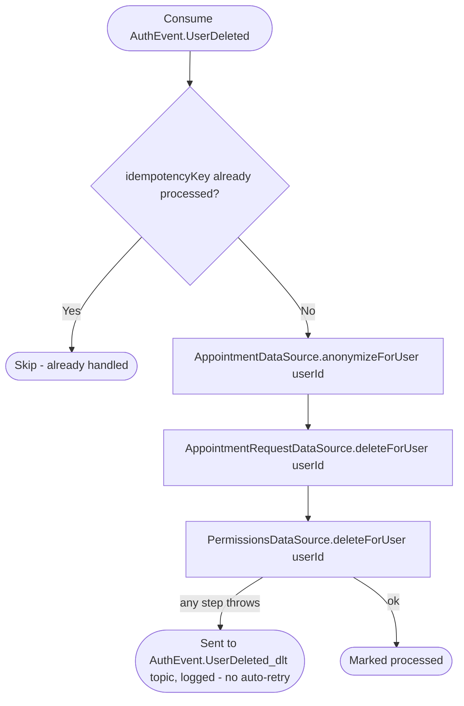

# React to user deletion

Kafka topic `AuthEvent.UserDeleted` → `AppointmentEventHandler` → `DeleteUserAppointmentData`

Produced by [Delete account](../authorization/delete-account.md). Strips
this user's appointment footprint regardless of which role they held
(client or employee) — anonymizes rather than deletes appointment rows
(financial/scheduling history for the other party in the appointment is
kept), but hard-deletes their own requests and permission grants.

