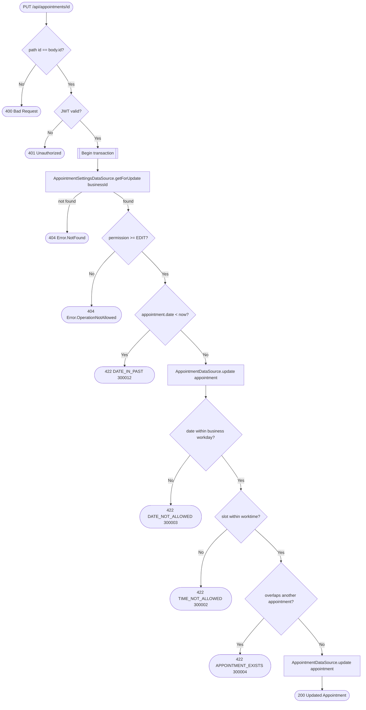

# Update appointment (reschedule)

`PUT /api/appointments/{id}` → `UpdateAppointment`

Reschedules an existing appointment. Note the datasource `update` call
happens twice in the current implementation — once before the workday/
worktime/overlap checks and once after — so a caller sees the row written
even if a later check throws; the checks only gate the second write.

