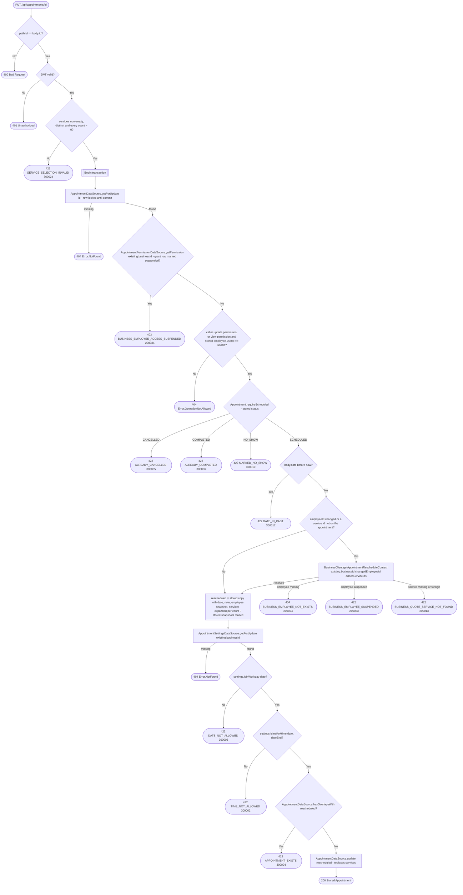

# Update appointment (reschedule)

`PUT /api/appointments/{id}` → `UpdateAppointment`

Reschedules a `SCHEDULED` appointment — date, note, assigned employee and
services. The body (`AppointmentUpdate`) carries only ids: `employeeId` and
`services` as `RequestedService(serviceId, count)`. No name, contact or price
is ever taken from the client:

- the **client** and **business** always stay those of the stored
  appointment — an update can neither swap the client nor move the
  appointment into another business;
- an **unchanged employee** keeps the stored `EmployeeSnapshot`; a new one is
  resolved from the business service;
- a **service already on the appointment** keeps its stored `ServiceSnapshot`,
  including its price, so rescheduling never silently re-prices a booking;
  only **newly added** services are resolved from the catalog.

When nothing needs resolving (a plain date/note change) no call leaves the
service. Otherwise one call, `BusinessClient.getAppointmentRescheduleContext`
(`POST /api/internal/business/{id}/appointment-reschedule-context`), resolves
the changed employee and the added services together. Unlike the booking
context it never resolves or creates a client.

The status only changes through [Cancel appointment](cancel-appointment.md),
[Complete appointment](complete-appointment.md) and [Mark appointment as
no-show](mark-appointment-no-show.md), or the `MarkAppointmentsCompleted`
job. The response is the stored appointment, not an echo of the body.

The stored appointment is read with `AppointmentDataSource.getForUpdate`
(`SELECT … FOR UPDATE`) as the first read and its status checked with
`Appointment.requireScheduled()`. The row lock is held until commit, so a
concurrent cancel, completion, no-show or job run waits for this
transaction. Lock order is appointment row → (business-service call) →
settings row: the settings lock serializes every booking write of the
business, so it is only taken after the HTTP call, right before the
workday/worktime/overlap checks it guards. That lock is the double-booking
guard — the `(user_id, business_id, date_start)` index is deliberately
non-unique so a cancelled appointment doesn't block its slot. Nothing is
written until every validation has passed. The appointment is fetched
before the permission check so a `view`-only employee can be let through
when it's their own — see [Managing your own resource on a `view`
grant](../../object-permissions.md#managing-your-own-resource-on-a-view-grant).

```mermaid
flowchart TD
    Start([PUT /api/appointments/id]) --> PathCheck{path id == body.id?}
    PathCheck -- No --> R400([400 Bad Request])
    PathCheck -- Yes --> Auth{JWT valid?}
    Auth -- No --> R401([401 Unauthorized])
    Auth -- Yes --> Selection{services non-empty, distinct and every count > 0?}
    Selection -- No --> R422v([422 SERVICE_SELECTION_INVALID 300024])
    Selection -- Yes --> Tx[[Begin transaction]]
    Tx --> Get[AppointmentDataSource.getForUpdate id - row locked until commit]
    Get -- missing --> R404a([404 Error.NotFound])
    Get -- found --> Suspended{AppointmentPermissionDataSource.getPermission existing.businessId - grant row marked suspended?}
    Suspended -- Yes --> R403s([403 BUSINESS_EMPLOYEE_ACCESS_SUSPENDED 200034])
    Suspended -- No --> Perm{caller update permission, or view permission and stored employee.userId == userId?}
    Perm -- No --> R404b([404 Error.OperationNotAllowed])
    Perm -- Yes --> Stored{Appointment.requireScheduled - stored status}
    Stored -- CANCELLED --> R422c([422 ALREADY_CANCELLED 300005])
    Stored -- COMPLETED --> R422d([422 ALREADY_COMPLETED 300006])
    Stored -- NO_SHOW --> R422e([422 MARKED_NO_SHOW 300019])
    Stored -- SCHEDULED --> Past{body.date before now?}
    Past -- Yes --> R422p([422 DATE_IN_PAST 300012])
    Past -- No --> Changes{employeeId changed or a service id not on the appointment?}
    Changes -- No --> Rebuild
    Changes -- Yes --> Resolve[BusinessClient.getAppointmentRescheduleContext existing.businessId changedEmployeeId addedServiceIds]
    Resolve -- employee missing --> R404e([404 BUSINESS_EMPLOYEE_NOT_EXISTS 200024])
    Resolve -- employee suspended --> R422es([422 BUSINESS_EMPLOYEE_SUSPENDED 200033])
    Resolve -- service missing or foreign --> R422sv([422 BUSINESS_QUOTE_SERVICE_NOT_FOUND 200013])
    Resolve -- resolved --> Rebuild[rescheduled = stored copy with date, note, employee snapshot, services expanded per count - stored snapshots reused]
    Rebuild --> Settings[AppointmentSettingsDataSource.getForUpdate existing.businessId]
    Settings -- missing --> R404s([404 Error.NotFound])
    Settings -- found --> Workday{settings.isInWorkday date?}
    Workday -- No --> R422w([422 DATE_NOT_ALLOWED 300003])
    Workday -- Yes --> Worktime{settings.isInWorktime date, dateEnd?}
    Worktime -- No --> R422t([422 TIME_NOT_ALLOWED 300002])
    Worktime -- Yes --> Overlap{AppointmentDataSource.hasOverlapsWith rescheduled?}
    Overlap -- Yes --> R422o([422 APPOINTMENT_EXISTS 300004])
    Overlap -- No --> Write[AppointmentDataSource.update rescheduled - replaces services]
    Write --> R200([200 Stored Appointment])
```

No event is published.
