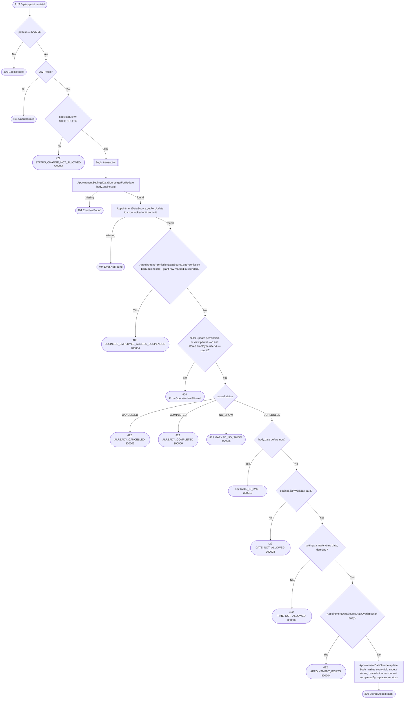

# Update appointment (reschedule)

`PUT /api/appointments/{id}` → `UpdateAppointment`

Edits a `SCHEDULED` appointment — date, services, note and snapshots. The
body is a full `Appointment`. Its `status` must be `SCHEDULED`, checked
before any database access: the status only changes through [Cancel
appointment](cancel-appointment.md), [Complete
appointment](complete-appointment.md) and [Mark appointment as
no-show](mark-appointment-no-show.md), or the `MarkAppointmentsCompleted`
job. `cancellationReason` and `completedBy` in the body are ignored. The
response is the stored appointment, not an echo of the body.

The body status says nothing about the stored one — a client holding a stale
copy still sends `SCHEDULED` for an appointment cancelled since — so the
stored appointment is read with `AppointmentDataSource.getForUpdate`
(`SELECT … FOR UPDATE`) and its status checked once. The row lock is held
until commit, so a concurrent cancel, completion, no-show or job run waits
for this transaction and cannot change the status between the check and the
write. Nothing is written until every validation has passed.

The settings row is read with `getForUpdate`, which serializes every
appointment write for the same business (create, reschedule), so the
`hasOverlapsWith` check cannot race another booking. That lock is the
double-booking guard — the `(user_id, business_id, date_start)` index is
deliberately non-unique so a cancelled appointment doesn't block its slot.
The appointment is fetched before the permission check so a `view`-only
employee can be let through when it's their own — see [Managing your own
resource on a `view`
grant](../../object-permissions.md#managing-your-own-resource-on-a-view-grant).

```mermaid
flowchart TD
    Start([PUT /api/appointments/id]) --> PathCheck{path id == body.id?}
    PathCheck -- No --> R400([400 Bad Request])
    PathCheck -- Yes --> Auth{JWT valid?}
    Auth -- No --> R401([401 Unauthorized])
    Auth -- Yes --> BodyStatus{body.status == SCHEDULED?}
    BodyStatus -- No --> R422s([422 STATUS_CHANGE_NOT_ALLOWED 300020])
    BodyStatus -- Yes --> Tx[[Begin transaction]]
    Tx --> Settings[AppointmentSettingsDataSource.getForUpdate body.businessId]
    Settings -- missing --> R404s([404 Error.NotFound])
    Settings -- found --> Get[AppointmentDataSource.getForUpdate id - row locked until commit]
    Get -- missing --> R404a([404 Error.NotFound])
    Get -- found --> Suspended{AppointmentPermissionDataSource.getPermission body.businessId - grant row marked suspended?}
    Suspended -- Yes --> R403s([403 BUSINESS_EMPLOYEE_ACCESS_SUSPENDED 200034])
    Suspended -- No --> Perm{caller update permission, or view permission and stored employee.userId == userId?}
    Perm -- No --> R404b([404 Error.OperationNotAllowed])
    Perm -- Yes --> Stored{stored status}
    Stored -- CANCELLED --> R422c([422 ALREADY_CANCELLED 300005])
    Stored -- COMPLETED --> R422d([422 ALREADY_COMPLETED 300006])
    Stored -- NO_SHOW --> R422e([422 MARKED_NO_SHOW 300019])
    Stored -- SCHEDULED --> Past{body.date before now?}
    Past -- Yes --> R422p([422 DATE_IN_PAST 300012])
    Past -- No --> Workday{settings.isInWorkday date?}
    Workday -- No --> R422w([422 DATE_NOT_ALLOWED 300003])
    Workday -- Yes --> Worktime{settings.isInWorktime date, dateEnd?}
    Worktime -- No --> R422t([422 TIME_NOT_ALLOWED 300002])
    Worktime -- Yes --> Overlap{AppointmentDataSource.hasOverlapsWith body?}
    Overlap -- Yes --> R422o([422 APPOINTMENT_EXISTS 300004])
    Overlap -- No --> Write[AppointmentDataSource.update body - writes every field except status, cancellation reason and completedBy, replaces services]
    Write --> R200([200 Stored Appointment])
```

No event is published.
