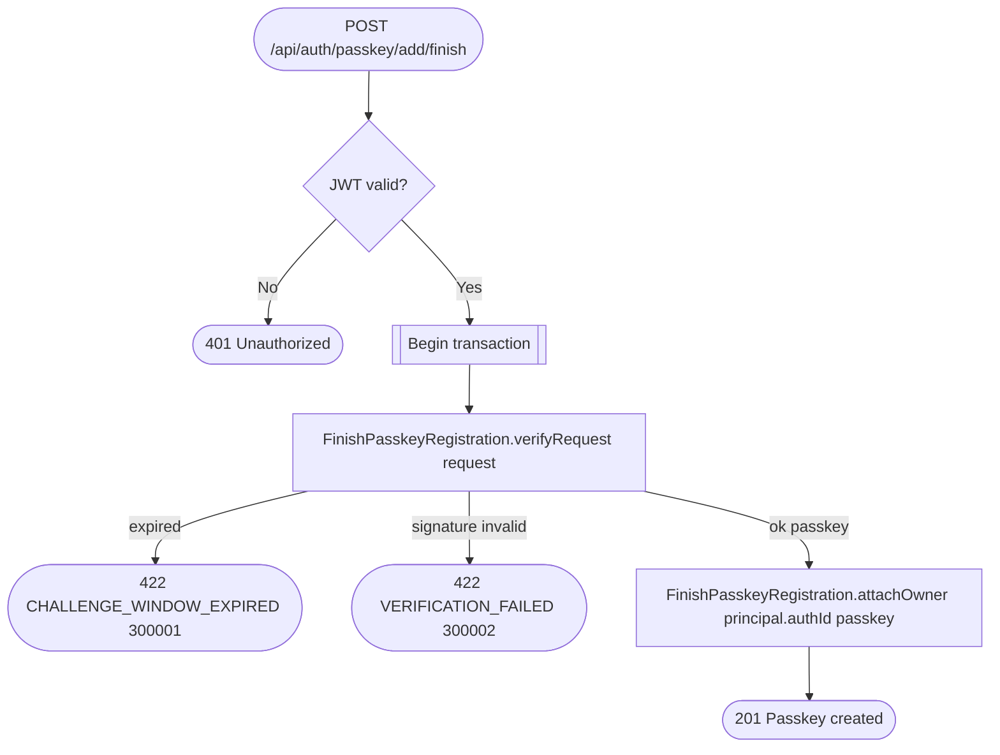

# Add passkey to account

`POST /api/auth/passkey/add/finish` → `AttachNewPasskeyToAccount`

Second step after `GET /api/auth/passkey/add/challenge`: verifies the
signed challenge and attaches the resulting credential to the currently
authenticated auth record, giving the account another sign-in method.

