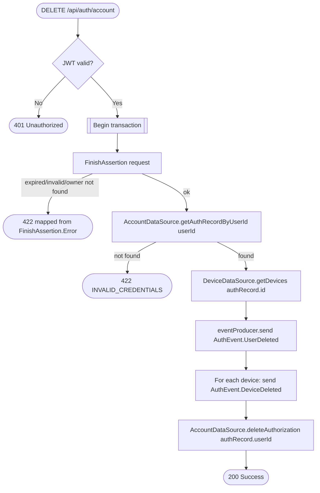

# Delete account

`DELETE /api/auth/account` → `DeleteAccount`

Requires a fresh passkey assertion as proof of possession before deleting
anything. Every device owned by the auth record is announced as deleted
before the auth record itself is removed, so downstream services (user,
business, notifications) can react and clean up their own data.

**Consumed by:** `AuthEvent.UserDeleted` fans out to four services —
[appointments](../appointments/on-user-deleted.md),
[business](../business/on-user-deleted.md),
[notifications](../notifications/on-user-deleted.md), and
[user](../user/on-user-deleted.md) (the actual profile delete) — run
independently and in no guaranteed order relative to each other or to this
route's own `deleteAuthorization` write. `AuthEvent.DeviceDeleted` (one per
device) → [notifications: remove the device's push-token
row](../notifications/on-device-deleted.md).
