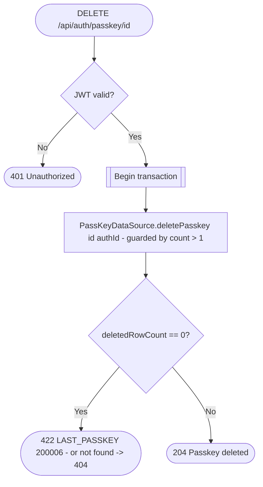

# Delete passkey

`DELETE /api/auth/passkey/{id}` → `DeletePasskey`

The delete is written as a single conditional statement scoped to
`(id, authId)` that also guards against removing an account's only
remaining passkey — the guard and the write share one row lock, so a
concurrent add/delete pair can't race past it. A `0`-row result means
either the passkey wasn't found, didn't belong to this auth record, or was
the last one.

