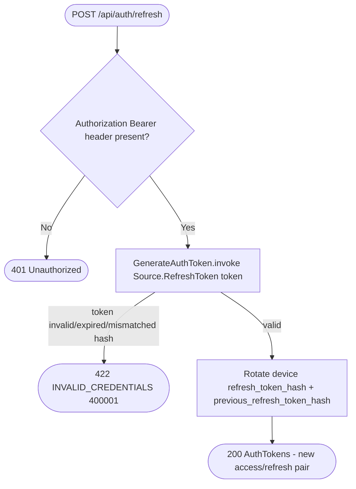

# Refresh access token

`POST /api/auth/refresh` (header `Authorization: Bearer <refresh token>`) → `RefreshToken`

Rotates the access/refresh pair for a device. The `Authorization` header is
read directly by the route (not through `AppPrincipal`, since the access
token has typically expired); `GenerateAuthToken` validates the refresh
token against the device's stored hash and issues a new pair.

