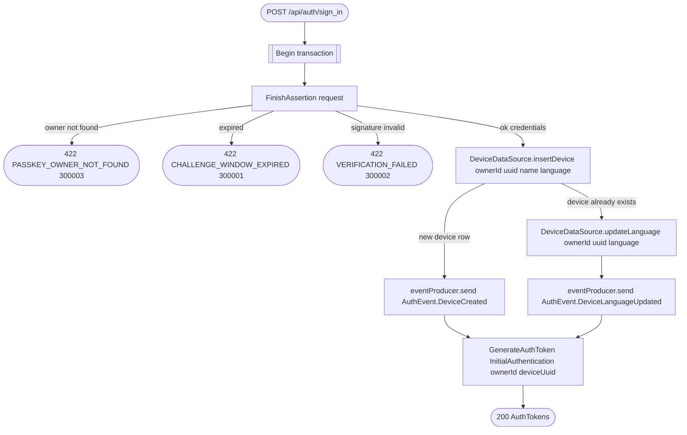

# Verify sign-in

`POST /api/auth/sign_in` → `SignIn`

Verifies the assertion produced against the challenge from `GET
/api/auth/passkey/sign_in/challenge`, then either registers this device as
new or just refreshes its language if it already signed in before — either
way a token pair is minted for it.

**Consumed by:** `AuthEvent.DeviceCreated` → [notifications: mirror the new
device](../notifications/on-device-created.md). `AuthEvent.DeviceLanguageUpdated`
→ [notifications: update the device's locale](../notifications/on-device-language-updated.md).
