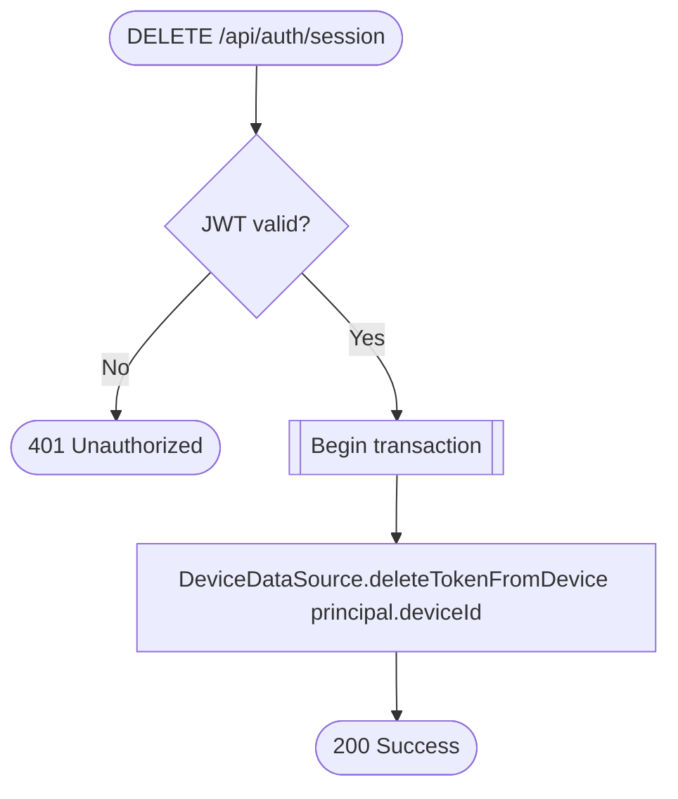

# Sign out

`DELETE /api/auth/session` → `SignOut`

Clears the calling device's stored refresh token so it can no longer mint
new access tokens; the device row itself is kept.

```mermaid
flowchart TD
    Start([DELETE /api/auth/session]) --> Auth{JWT valid?}
    Auth -- No --> R401([401 Unauthorized])
    Auth -- Yes --> Tx[[Begin transaction]]
    Tx --> Delete[DeviceDataSource.deleteTokenFromDevice principal.deviceId]
    Delete --> R200([200 Success])
```
