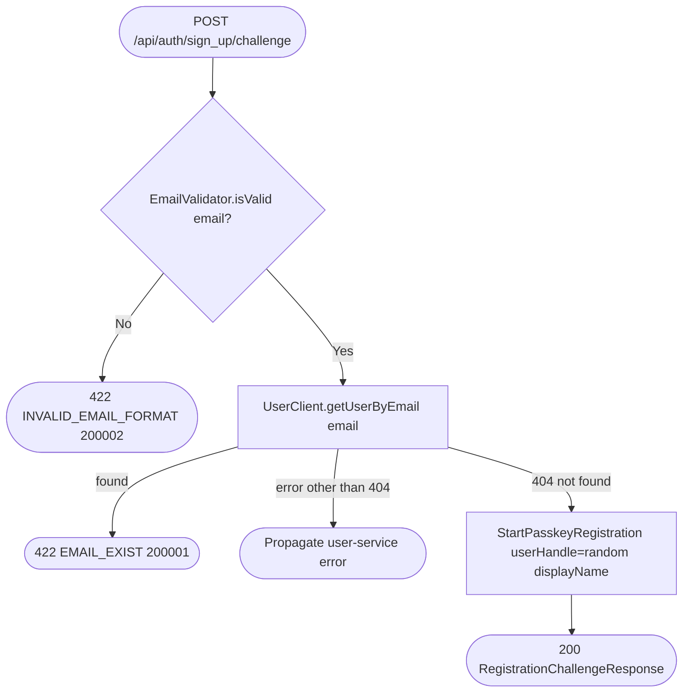

# Get sign-up challenge

`POST /api/auth/sign_up/challenge` → `StartRegistration`

The first step of registration: validates the email, confirms no user
already owns it (via the user service), then asks the WebAuthn layer for a
passkey creation challenge. No account row exists yet — that only happens
once [Verify sign-up](sign-up.md) verifies the signed challenge.

