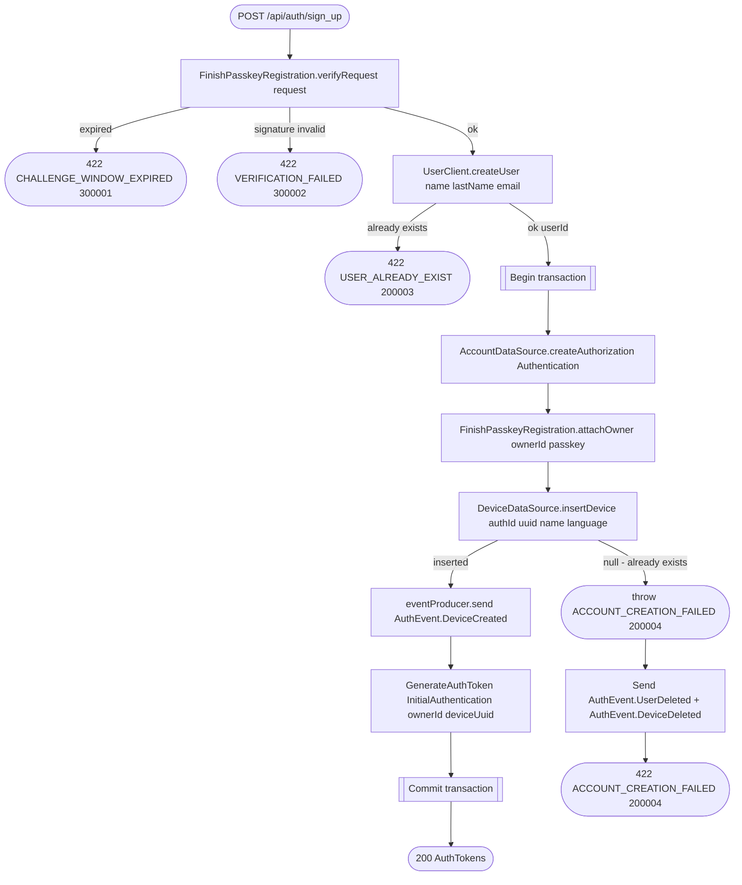

# Verify sign-up (create account)

`POST /api/auth/sign_up` → `FinishRegistration`

Verifies the signed WebAuthn challenge from [Get sign-up
challenge](sign-up-challenge.md), then creates the user (in the user
service), the local `Authentication` record, the passkey credential, the
first device, and the initial token pair — all inside one transaction. If
anything inside the transaction fails, the already-created remote user and
device are rolled back via compensating `UserDeleted`/`DeviceDeleted`
events rather than a distributed transaction.

**Consumed by:** `AuthEvent.DeviceCreated` → [notifications: mirror the new
device](../notifications/on-device-created.md). The compensating
`AuthEvent.UserDeleted`/`AuthEvent.DeviceDeleted` sent on failure fan out to
the same consumers as [Delete account](delete-account.md)'s "Consumed by"
section, even though no account ever successfully existed here.
