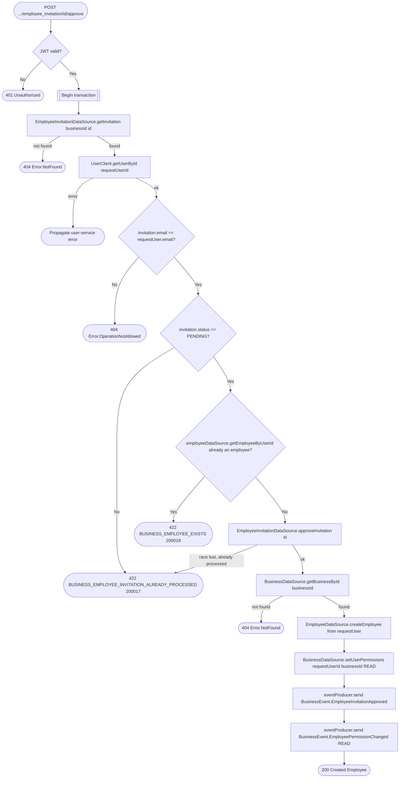

# Approve employee invitation

`POST /api/business/{businessId}/employee_invitation/{id}/approve` → `ApproveEmployeeInvitation`

Only the invited email's own user can approve their invitation — the
caller identity is cross-checked against the invitation's `email` via the
user service, and a mismatch is reported as the same 404 as a missing
invitation so an attacker can't distinguish "not invited" from "invited
someone else". Approval creates the `Employee` row and grants baseline
`READ` permission on the business.

**Consumed by:** `BusinessEvent.EmployeeInvitationApproved` → [notifications:
notify the inviter](../notifications/on-employee-invitation-approved.md).
`BusinessEvent.EmployeePermissionChanged` → [appointments: sync employee
permission](../appointments/on-employee-permission-changed.md).
