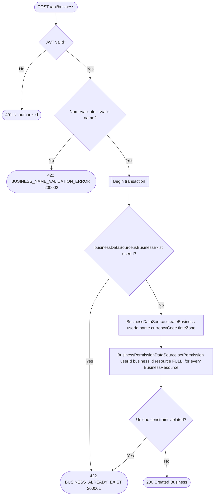

# Create business

`POST /api/business` → `CreateBusiness`

A user owns at most one business (`BusinessTable.userId` is a unique
index), so the existence check and the unique-constraint fallback both
guard the same invariant.

