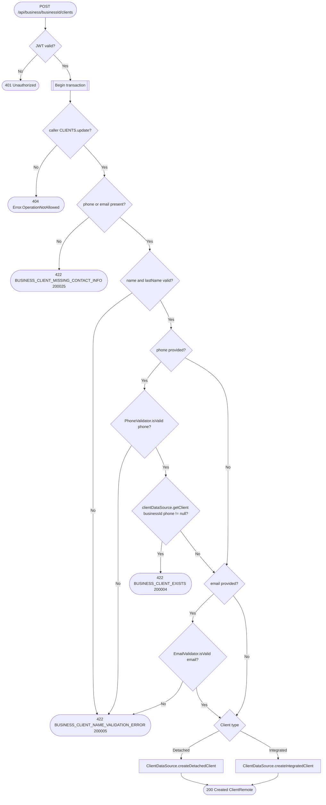

# Create client

`POST /api/business/{businessId}/clients` → `CreateClient`

Clients come in two flavors — `Detached` (a business-entered contact with
no app account) and `Integrated` (linked to a real user) — routed to
separate datasource inserts based on the sealed `Client` type. Both `phone`
and `email` are optional, but at least one must be present. Uniqueness is
enforced per business+phone, and only checked when a phone is given; email
is only format-validated, not deduplicated.

