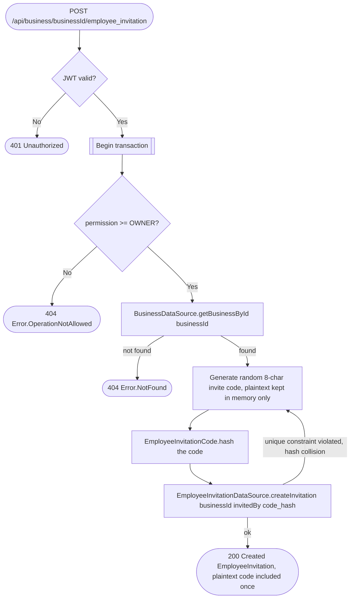

# Invite employee

`POST /api/business/{businessId}/employee_invitation` → `CreateEmployeeInvitation`

Only an `OWNER` can invite (stricter than the usual `EDIT` bar elsewhere in
this service). No employee identity is collected at invite time — the
operation just mints a short, random invite code the owner shares with a
future employee out of band (verbally, a QR code, etc). The employee later
joins the business themselves via [Join business](join-business.md); the
server never sees or stores the employee's email for this flow. On the
rare chance the generated code collides with an existing one, the
operation retries with a freshly generated code before giving up.

The database never stores the plaintext code — only its SHA-256 hex hash
(`EmployeeInvitationTable.codeHash`, column `code_hash`, see [business
service schema](../../database/business.md)). Hashing happens in
`CreateEmployeeInvitationImpl` (`EmployeeInvitationCode.hash`), not the
datasource — `EmployeeInvitationDataSource.createInvitation` only ever
receives and stores the hash, it has no hashing logic of its own. The
plaintext is generated in memory, hashed before the datasource call, and
handed back to the caller in this one response by overwriting the
datasource's echoed-back result with the plaintext the operation still
holds locally; it cannot be recovered afterward, including by the "Get
employee invitations" list endpoint (a read-only `GET` route, out of scope
for these diagrams — it always returns `code = null` since the plaintext
was never persisted) or by a database compromise. The `code_hash` column
is nullable and cleared the moment an invitation leaves
`PENDING` (redeemed, revoked, or expired — see [Join
business](join-business.md), [Revoke employee
invitation](revoke-employee-invitation.md) and the
`expireEmployeeInvitations` job in [Scheduled (recurring)
jobs](../scheduled-jobs.md)), so its unique index only ever has to stay
collision-free across invitations that are still `PENDING`, not every
invitation ever issued.

