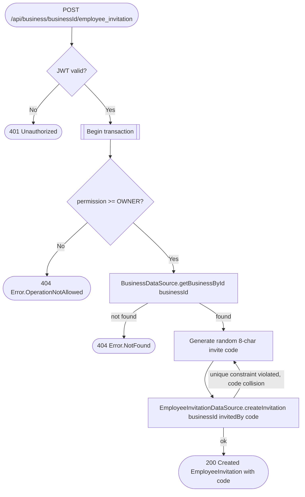

# Invite employee

`POST /api/business/{businessId}/employee_invitation` → `CreateEmployeeInvitation`

Only an `OWNER` can invite (stricter than the usual `EDIT` bar elsewhere in
this service). No employee identity is collected at invite time — the
operation just mints a short, random invite code the owner shares with a
future employee out of band (verbally, a QR code, etc). The employee later
joins the business themselves via [Join business](join-business.md); the
server never sees or stores the employee's email for this flow. On the
rare chance the generated code collides with an existing one, the
operation retries with a freshly generated code before giving up. The
`code` column is nullable and cleared the moment an invitation leaves
`PENDING` (redeemed, revoked, or expired — see [Join
business](join-business.md), [Revoke employee
invitation](revoke-employee-invitation.md) and the
`expireEmployeeInvitations` job in [Scheduled (recurring)
jobs](../scheduled-jobs.md)), so its unique index only ever has to stay
collision-free across invitations that are still `PENDING`, not every
invitation ever issued.

