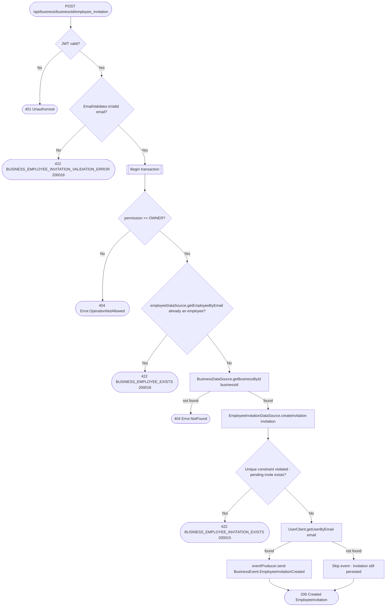

# Invite employee

`POST /api/business/{businessId}/employee_invitation` → `CreateEmployeeInvitation`

Only an `OWNER` can invite (stricter than the usual `EDIT` bar elsewhere in
this service). The invite-email lookup against the user service is
best-effort: if the invited email has no matching user yet, the
`EmployeeInvitationCreated` event is simply skipped rather than failing the
whole request — the invitation row still exists for when they sign up.

**Consumed by:** `BusinessEvent.EmployeeInvitationCreated` → [notifications:
notify the invited user](../notifications/on-employee-invitation-created.md)
— only fires when the email lookup above succeeds.
