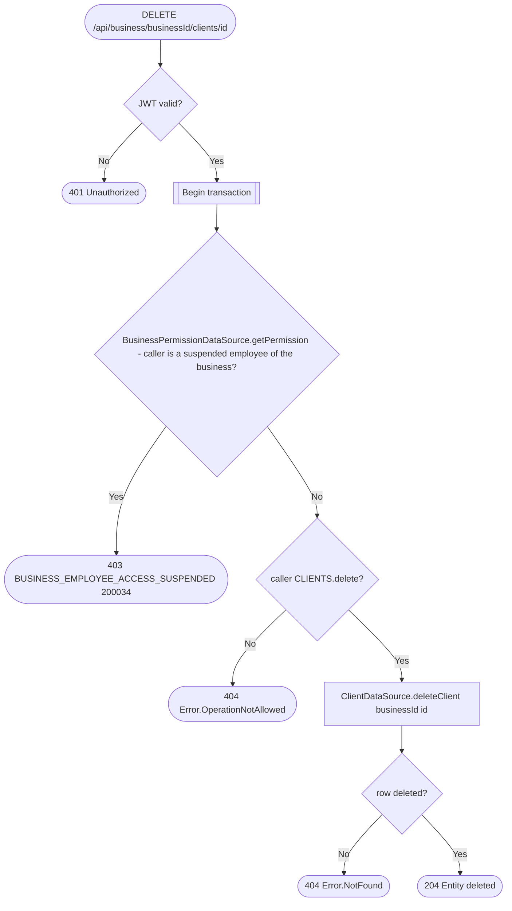

# Delete client

`DELETE /api/business/{businessId}/clients/{id}` → `DeleteClient`

```mermaid
flowchart TD
    Start([DELETE /api/business/businessId/clients/id]) --> Auth{JWT valid?}
    Auth -- No --> R401([401 Unauthorized])
    Auth -- Yes --> Tx[[Begin transaction]]
    Tx --> Suspended{BusinessPermissionDataSource.getPermission - caller is a suspended employee of the business?}
    Suspended -- Yes --> R403s([403 BUSINESS_EMPLOYEE_ACCESS_SUSPENDED 200034])
    Suspended -- No --> Perm{caller CLIENTS.delete?}
    Perm -- No --> R404a([404 Error.OperationNotAllowed])
    Perm -- Yes --> Delete[ClientDataSource.deleteClient businessId id]
    Delete --> Found{row deleted?}
    Found -- No --> R404b([404 Error.NotFound])
    Found -- Yes --> R204([204 Entity deleted])
```
