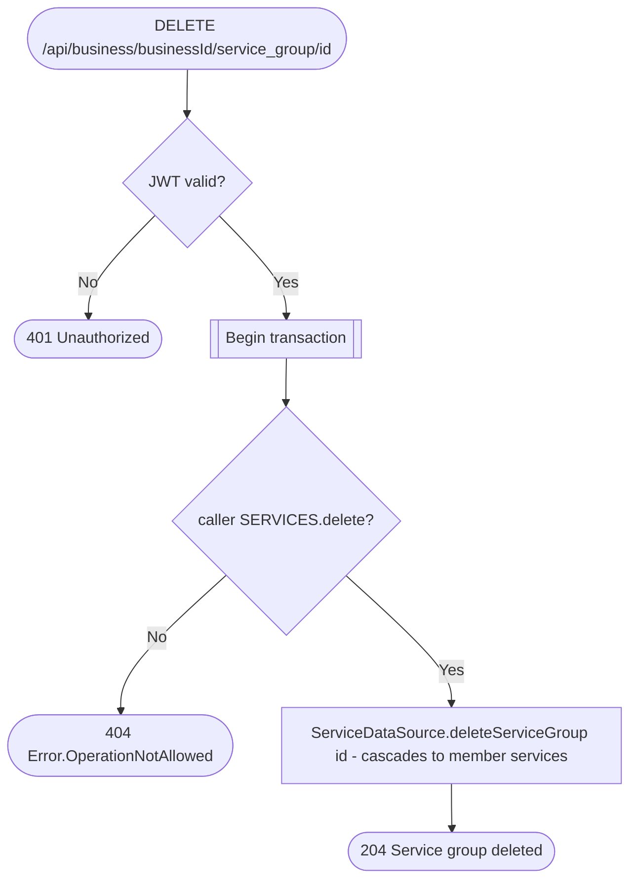

# Delete service group

`DELETE /api/business/{businessId}/service_group/{id}` → `DeleteServiceGroup`

Deletes the group and, per the route's own description, every service that
belongs to it (cascading delete happens at the datasource/table level).

