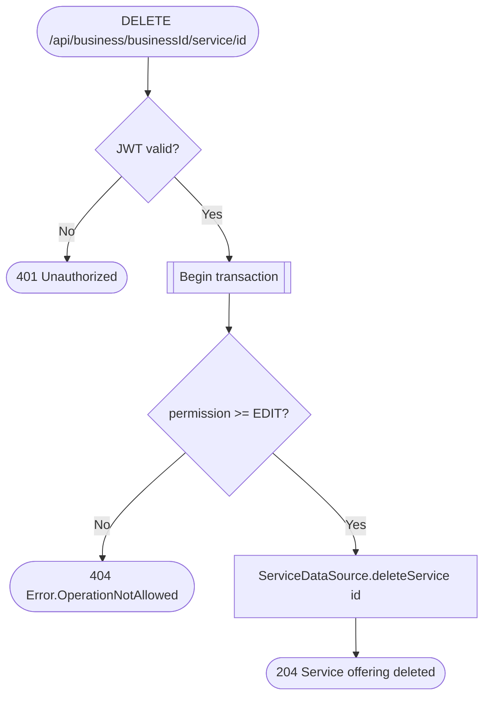

# Delete service

`DELETE /api/business/{businessId}/service/{id}` → `DeleteService`

```mermaid
flowchart TD
    Start([DELETE /api/business/businessId/service/id]) --> Auth{JWT valid?}
    Auth -- No --> R401([401 Unauthorized])
    Auth -- Yes --> Tx[[Begin transaction]]
    Tx --> Perm{permission >= EDIT?}
    Perm -- No --> R404([404 Error.OperationNotAllowed])
    Perm -- Yes --> Delete[ServiceDataSource.deleteService id]
    Delete --> R204([204 Service offering deleted])
```
