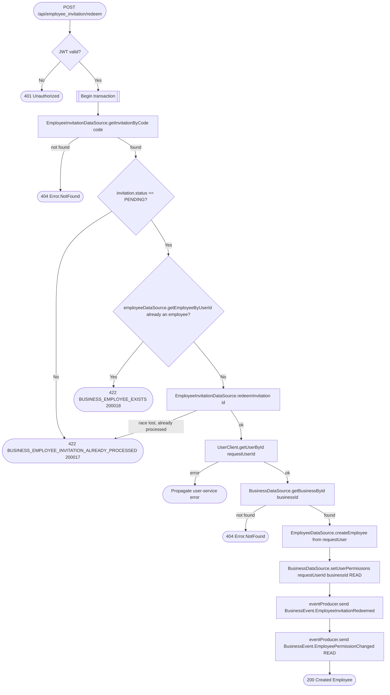

# Join business

`POST /api/employee_invitation/redeem` → `JoinBusiness`

Any authenticated user can join a business by submitting the invite code
shared with them by the business owner — there is no per-user targeting,
whoever holds a `PENDING` code can join. Joining creates the `Employee`
row for the calling user and grants baseline `READ` permission on the
business.

**Consumed by:** `BusinessEvent.EmployeeInvitationRedeemed` → [notifications:
notify the inviter](../notifications/on-employee-invitation-redeemed.md).
`BusinessEvent.EmployeePermissionChanged` → [appointments: sync employee
permission](../appointments/on-employee-permission-changed.md).
