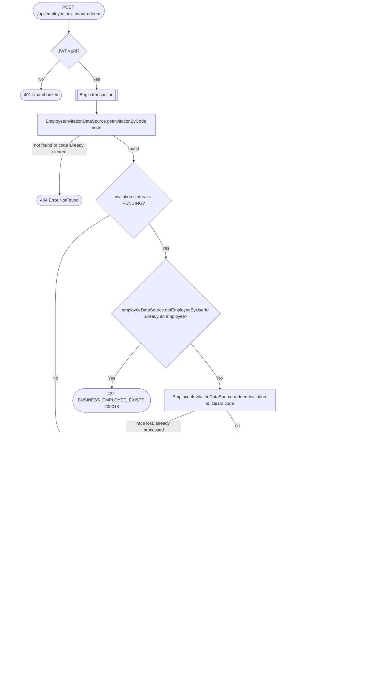

# Join business

`POST /api/employee_invitation/redeem` → `JoinBusiness`

Any authenticated user can join a business by submitting the invite code
shared with them by the business owner — there is no per-user targeting,
whoever holds a `PENDING` code can join. Joining creates the `Employee`
row for the calling user and grants baseline `READ` permission on the
business. `redeemInvitation` also clears the invitation's `code` column
(nullable, see [Invite employee](create-employee-invitation.md)) so it can
be handed out again to a future invitee. Because the code is gone as soon
as it's consumed, resubmitting an already-redeemed code later looks
identical to submitting a code that never existed — `getInvitationByCode`
simply won't find it, so the caller gets 404 rather than the 422
`ALREADY_PROCESSED` error. That error is still reached for the genuine
race: two requests fetching the same still-`PENDING` invitation before
either commits, where the loser's `redeemInvitation` call matches zero
rows.

**Consumed by:** `BusinessEvent.EmployeeInvitationRedeemed` → [notifications:
notify the inviter](../notifications/on-employee-invitation-redeemed.md).
`BusinessEvent.EmployeePermissionChanged` → [appointments: sync employee
permission](../appointments/on-employee-permission-changed.md).
