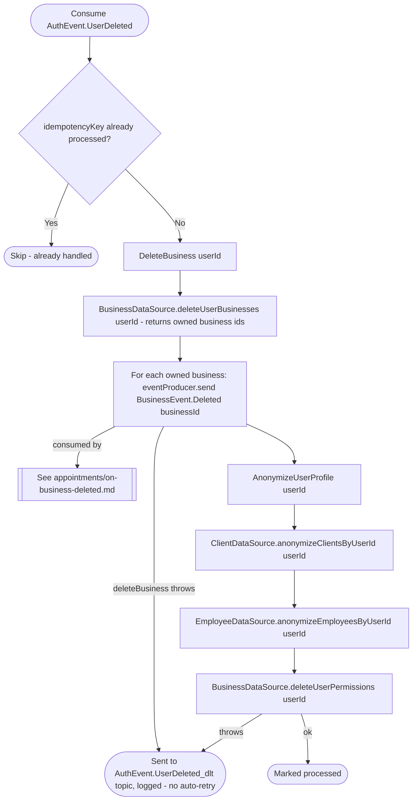

# React to user deletion

Kafka topic `AuthEvent.UserDeleted` → `BusinessEventHandlerImpl` → `DeleteBusiness` + `AnonymizeUserProfile`

Produced by [Delete account](../authorization/delete-account.md). Two
steps, and only the first one gates the second: `deleteBusiness` is
unwrapped with `.getOrThrow()` inline, so if it fails the handler throws
immediately and `anonymizeUserProfile` never runs; `anonymizeUserProfile`'s
own `Result` is the lambda's return value, so *its* failure still reaches
the framework's dead-letter handling, just after the deletes below have
already been attempted.

